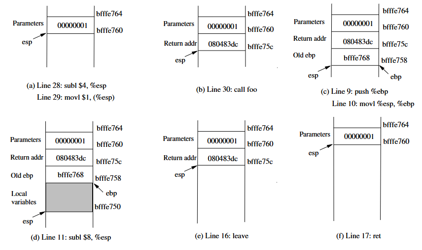

# Information Security HW03

[TOC]

## 3.1 SEED Lab (20 pts)
[Shellcode Development Lab](https://seedsecuritylabs.org/Labs_20.04/Software/Shellcode/)

### solutions
see the code and documentation
- code : [/Shellcode/](./Shellcode/)
- documentation : [Shellcode/Shellcode.md](./Shellcode/Shellcode.md)


## 3.2 SEED Lab (30 pts)
[Return-to-libc Attack Lab](https://seedsecuritylabs.org/Labs_20.04/Software/Return_to_Libc/)

### solutions
see the code and documentation
- code : [Return_to_Libc/](./Return_to_Libc/)
- documentation : [Return_to_Libc/Return_to_Libc.md](./Return_to_Libc/Return_to_Libc.md)


#### 2 Environment Setup

##### 2.1 Note on x86 and x64 Architectures

The return-to-libc attack on the x64 machines (64-bit) is much more difficult than that on the x86 machines
(32-bit). Although the SEED Ubuntu 20.04 VM is a 64-bit machine, we decide to keep using the 32-bit
programs (x64 is compatible with x86, so 32-bit programs can still run on x64 machines). In the future, we
may introduce a 64-bit version for this lab. Therefore, in this lab, when we compile programs using gcc,
we always use the -m32 flag, which means compiling the program into 32-bit binary.

##### 2.2 Turning off countermeasures

You can execute the lab tasks using our pre-built Ubuntu virtual machines. Ubuntu and other Linux dis-
tributions have implemented several security mechanisms to make the buffer-overflow attack difficult. To
simplify our attacks, we need to disable them first.
Address Space Randomization. Ubuntu and several other Linux-based systems use address space ran-
domization to randomize the starting address of heap and stack, making guessing the exact addresses diffi-
cult. Guessing addresses is one of the critical steps of buffer-overflow attacks. In this lab, we disable this
feature using the following command:
`$ sudo sysctl -w kernel.randomize_va_space=0`
The StackGuard Protection Scheme. The gcc compiler implements a security mechanism called Stack-
Guard to prevent buffer overflows. In the presence of this protection, buffer overflow attacks do not work.
We can disable this protection during the compilation using the -fno-stack-protector option. For example,
to compile a program example.c with StackGuard disabled, we can do the following:
`$ gcc -m32 -fno-stack-protector example.c`
Non-Executable Stack. Ubuntu used to allow executable stacks, but this has now changed. The binary
images of programs (and shared libraries) must declare whether they require executable stacks or not, i.e.,
they need to mark a field in the program header. Kernel or dynamic linker uses this marking to decide
whether to make the stack of this running program executable or non-executable. This marking is done
automatically by the recent versions of gcc, and by default, stacks are set to be non-executable. To change
that, use the following option when compiling programs:

```
For executable stack:
$ gcc -m32 -z execstack -o test test.c
For non-executable stack:
$ gcc -m32 -z noexecstack -o test test.c
```

Because the objective of this lab is to show that the non-executable stack protection does not work, you
should always compile your program using the "-z noexecstack" option in this lab.
Configuring /bin/sh. In Ubuntu 20.04, the /bin/sh symbolic link points to the /bin/dash shell.
The dash shell has a countermeasure that prevents itself from being executed in a Set-UID process. If
SEED Labs – Return-to-libc Attack Lab 3
dash is executed in a Set-UID process, it immediately changes the effective user ID to the process’s real
user ID, essentially dropping its privilege.
Since our victim program is a Set-UID program, and our attack uses the system() function to
run a command of our choice. This function does not run our command directly; it invokes /bin/sh
to run our command. Therefore, the countermeasure in /bin/dash immediately drops the Set-UID
privilege before executing our command, making our attack more difficult. To disable this protection, we
link /bin/sh to another shell that does not have such a countermeasure. We have installed a shell program
called zsh in our Ubuntu 16.04 VM. We use the following commands to link /bin/sh to zsh:
`$ sudo ln -sf /bin/zsh /bin/sh`
It should be noted that the countermeasure implemented in dash can be circumvented. We will do that
in a later task.

#### 2.3 The Vulnerable Program

Listing 1: The vulnerable program (retlib.c)

```c
# include <stdlib.h>

# include <stdio.h>

# include <string.h>

# ifndef BUF_SIZE

# define BUF_SIZE 12

# endif

int bof(char *str)
{
char buffer[BUF_SIZE];
unsigned int *framep;
// Copy ebp into framep
asm("movl %%ebp, %0" : "=r" (framep));
/* print out information for experiment purpose*/
printf("Address of buffer[] inside bof(): 0x%.8x\n", (unsigned)buffer);
printf("Frame Pointer value inside bof(): 0x%.8x\n", (unsigned)framep);
strcpy(buffer, str);fi buffer overflow!
return 1;
}
int main(int argc, char **argv)
{
char input[1000];
FILE *badfile;
badfile = fopen("badfile", "r");
int length = fread(input, sizeof(char), 1000, badfile);
printf("Address of input[] inside main(): 0x%x\n", (unsigned int) input);
printf("Input size: %d\n", length);
SEED Labs – Return-to-libc Attack Lab 4
bof(input);
printf("(ˆ_ˆ)(ˆ_ˆ) Returned Properly (ˆ_ˆ)(ˆ_ˆ)\n");
return 1;
}
// This function will be used in the optional task
void foo(){
static int i = 1;
printf("Function foo() is invoked %d times\n", i++);
return;
}
```

The above program has a buffer overflow vulnerability. It first reads an input up to 1000 bytes from
a file called badfile. It then passes the input data to the bof() function, which copies the input to its
internal buffer using strcpy(). However, the internal buffer’s size is less than 1000, so here is potential
buffer-overflow vulnerability.
This program is a root-owned Set-UID program, so if a normal user can exploit this buffer overflow
vulnerability, the user might be able to get a root shell. It should be noted that the program gets its input
from a file called badfile, which is provided by users. Therefore, we can construct the file in a way such
that when the vulnerable program copies the file contents into its buffer, a root shell can be spawned.

##### Compilation

Let us first compile the code and turn it into a root-owned Set-UID program. Do not forget

to include the -fno-stack-protector option (for turning off the StackGuard protection) and the "-z
noexecstack" option (for turning on the non-executable stack protection). It should also be noted that
changing ownership must be done before turning on the Set-UID bit, because ownership changes cause
the Set-UID bit to be turned off. All these commands are included in the provided Makefile.

```
// Note: N should be replaced by the value set by the instructor
$ gcc -m32 -DBUF_SIZE=N -fno-stack-protector -z noexecstack -o retlib retlib.c
$ sudo chown root retlib
$ sudo chmod 4755 retlib
```

##### For instructors

To prevent students from using the solutions from the past (or from those posted on the
Internet), instructors can change the value for BUF SIZE by requiring students to compile the code using
a different BUF SIZE value. Without the -DBUF SIZE option, BUF SIZE is set to the default value 12
(defined in the program). When this value changes, the layout of the stack will change, and the solution
will be different. Students should ask their instructors for the value of N. The value of N can be set in the
provided Makefile and N can be from 10 to 800.

### 3 Lab Tasks

#### 3.1 Task 1: Finding out the Addresses of libc Functions

In Linux, when a program runs, the libc library will be loaded into memory. When the memory address
randomization is turned off, for the same program, the library is always loaded in the same memory address
(for different programs, the memory addresses of the libc library may be different). Therefore, we can
easily find out the address of system() using a debugging tool such as gdb. Namely, we can debug the
SEED Labs – Return-to-libc Attack Lab 5
target program retlib. Even though the program is a root-owned Set-UID program, we can still debug
it, except that the privilege will be dropped (i.e., the effective user ID will be the same as the real user ID).
Inside gdb, we need to type the run command to execute the target program once, otherwise, the library
code will not be loaded. We use the p command (or print) to print out the address of the system() and
exit() functions (we will need exit() later on).

```bash
$ touch badfile
$ gdb -q retlibŸ Use "Quiet" mode
Reading symbols from ./retlib...
(No debugging symbols found in ./retlib)
gdb-peda$ break main
Breakpoint 1 at 0x1327
gdb-peda$ run
......
Breakpoint 1, 0x56556327 in main ()
gdb-peda$ p system
$1 = {<text variable, no debug info>} 0xf7e12420 <system>
gdb-peda$ p exit
$2 = {<text variable, no debug info>} 0xf7e04f80 <exit>
gdb-peda$ quit
```

It should be noted that even for the same program, if we change it from a Set-UID program to a
non-Set-UID program, the libc library may not be loaded into the same location. Therefore, when we
debug the program, we need to debug the target Set-UID program; otherwise, the address we get may be
incorrect.
Running gdb in batch mode. If you prefer to run gdb in a batch mode, you can put the gdb commands
in a file, and then ask gdb to execute the commands from this file:

```
$ cat gdb_command.txt
break main
run
p system
p exit
quit
$ gdb -q -batch -x gdb_command.txt ./retlib
...
Breakpoint 1, 0x56556327 in main ()
$1 = {<text variable, no debug info>} 0xf7e12420 <system>
$2 = {<text variable, no debug info>} 0xf7e04f80 <exit>
```

#### 3.2 Task 2: Putting the shell string in the memory

Our attack strategy is to jump to the system() function and get it to execute an arbitrary command.
Since we would like to get a shell prompt, we want the system() function to execute the "/bin/sh"
program. Therefore, the command string "/bin/sh" must be put in the memory first and we have to know
its address (this address needs to be passed to the system() function). There are many ways to achieve
these goals; we choose a method that uses environment variables. Students are encouraged to use other
approaches.
When we execute a program from a shell prompt, the shell actually spawns a child process to execute the
program, and all the exported shell variables become the environment variables of the child process. This
SEED Labs – Return-to-libc Attack Lab 6
creates an easy way for us to put some arbitrary string in the child process’s memory. Let us define a new
shell variable MYSHELL, and let it contain the string "/bin/sh". From the following commands, we can
verify that the string gets into the child process, and it is printed out by the env command running inside
the child process.

```
$ export MYSHELL=/bin/sh
$ env | grep MYSHELL
MYSHELL=/bin/sh
```

We will use the address of this variable as an argument to system() call. The location of this variable
in the memory can be found out easily using the following program:

```
void main(){
char* shell = getenv("MYSHELL");
if (shell)
printf("%x\n", (unsigned int)shell);
}
```

Compile the code above into a binary called prtenv. If the address randomization is turned off, you
will find out that the same address is printed out. When you run the vulnerable program retlib inside the
same terminal, the address of the environment variable will be the same (see the special note below). You
can verify that by putting the code above inside retlib.c. However, the length of the program name does
make a difference. That’s why we choose 6 characters for the program name prtenv to match the length
of retlib.

##### Note

You should use the -m32 flag when compiling the above program, so the binary code prtenv will
be for 32-bit machines, instead of for 64-bit ones. The vulnerable program retlib is a 32-bit binary, so if
prtenv is 64-bit, the address of the environment variable will be different.

#### 3.3 Task 3: Launching the Attack

We are ready to create the content of badfile. Since the content involves some binary data (e.g., the
address of the libc functions), we can use Python to do the construction. We provide a skeleton of the
code in the following, with the essential parts left for you to fill out.

```py
# !/usr/bin/env python3

import sys

# Fill content with non-zero values

content = bytearray(0xaa for i in range(300))
X = 0
sh_addr = 0x00000000 # The address of "/bin/sh"
content[X:X+4] = (sh_addr).to_bytes(4,byteorder=’little’)
Y = 0
system_addr = 0x00000000 # The address of system()
content[Y:Y+4] = (system_addr).to_bytes(4,byteorder=’little’)
Z = 0
exit_addr = 0x00000000 # The addres.s of exit()
content[Z:Z+4] = (exit_addr).to_bytes(4,byteorder=’little’)
SEED Labs – Return-to-libc Attack Lab 7

# Save content to a file

with open("badfile", "wb") as f:
f.write(content)
```

You need to figure out the three addresses and the values for X, Y, and Z. If your values are incorrect,
your attack might not work. In your report, you need to describe how you decide the values for X, Y and Z.
Either show us your reasoning or, if you use a trial-and-error approach, show your trials.

##### A note regarding gdb

If you use gdb to figure out the values for X, Y, and Z, it should be noted that the
gdb behavior in Ubuntu 20.04 is slightly different from that in Ubuntu 16.04. In particular, after we set a
break point at function bof, when gdb stops inside the bof() function, it stops before the ebp register is
set to point to the current stack frame, so if we print out the value of ebp here, we will get the caller’s ebp
value, not bof’s ebp. We need to type next to execute a few instructions and stop after the ebp register
is modified to point to the stack frame of the bof() function. The SEED book (2nd edition) is based on
Ubuntu 16.04, so it does not have this next step.

##### Attack variation 1: Is the exit() function really necessary? Please try your attack without including

the address of this function in badfile. Run your attack again, report and explain your observations.

##### Attack variation 2: After your attack is successful, change the file name of retlib to a different name

making sure that the length of the new file name is different. For example, you can change it to newretlib.
Repeat the attack (without changing the content of badfile). Will your attack succeed or not? If it does
not succeed, explain why.

#### 3.4 Task 4: Defeat Shell’s countermeasure

The purpose of this task is to launch the return-to-libc attack after the shell’s countermeasure is enabled.
Before doing Tasks 1 to 3, we relinked /bin/sh to /bin/zsh, instead of to /bin/dash (the original
setting). This is because some shell programs, such as dash and bash, have a countermeasure that auto-
matically drops privileges when they are executed in a Set-UID process. In this task, we would like to
defeat such a countermeasure, i.e., we would like to get a root shell even though the /bin/sh still points
to /bin/dash. Let us first change the symbolic link back:
`$ sudo ln -sf /bin/dash /bin/sh`
Although dash and bash both drop the Set-UID privilege, they will not do that if they are invoked
with the -p option. When we return to the system function, this function invokes /bin/sh, but it does
not use the -p option. Therefore, the Set-UID privilege of the target program will be dropped. If there
is a function that allows us to directly execute "/bin/bash -p", without going through the system
function, we can still get the root privilege.
There are actually many libc functions that can do that, such as the exec() family of functions, includ-
ing execl(), execle(), execv(), etc. Let’s take a look at the execv() function.
`int execv(const char *pathname, char*const argv[]);`
This function takes two arguments, one is the address to the command, the second is the address to the
argument array for the command. For example, if we want to invoke "/bin/bash -p" using execv,
we need to set up the following:

```
pathname = address of "/bin/bash"
argv[0] = address of "/bin/bash"
argv[1] = address of "-p"
argv[2] = NULL (i.e., 4 bytes of zero).
```

From the previous tasks, we can easily get the address of the two involved strings. Therefore, if we can
construct the argv[] array on the stack, get its address, we will have everything that we need to conduct
the return-to-libc attack. This time, we will return to the execv() function.
There is one catch here. The value of argv[2] must be zero (an integer zero, four bytes). If we put
four zeros in our input, strcpy() will terminate at the first zero; whatever is after that will not be copied
into the bof() function’s buffer. This seems to be a problem, but keep in mind, everything in your input is
already on the stack; they are in the main() function’s buffer. It is not hard to get the address of this buffer.
To simplify the task, we already let the vulnerable program print out that address for you.
Just like in Task 3, you need to construct your input, so when the bof() function returns, it returns
to execv(), which fetches from the stack the address of the "/bin/bash" string and the address of
the argv[] array. You need to prepare everything on the stack, so when execv() gets executed, it can
execute "/bin/bash -p" and give you the root shell. In your report, please describe how you construct
your input.

#### 3.5 Task 5 (Optional): Return-Oriented Programming

There are many ways to solve the problem in Task 4. Another way is to invoke setuid(0) before invoking
system(). The setuid(0) call sets both real user ID and effective user ID to 0, turning the process
into a non-Set-UID one (it still has the root privilege). This approach requires us to chain two functions
together. The approach was generalized to chaining multiple functions together, and was further generalized
to chain multiple pieces of code together. This led to the Return-Oriented Programming (ROP).
Using ROP to solve the problem in Task 4 is quite sophisticated, and it is beyond the scope of this lab.
However, we do want to give students a taste of ROP, asking them to work on a special case of ROP. In the
retlib.c program, there is a function called foo(), which is never called in the program. That function
is intended for this task. Your job is to exploit the buffer-overflow problem in the program, so when the
program returns from the bof() function, it invokes foo() 10 times, before giving you the root shell. In
your lab report, you need to describe how your input is constructed. Here is what the results will look like.

```bash
$ ./retlib
...
Function foo() is invoked 1 times
Function foo() is invoked 2 times
Function foo() is invoked 3 times
Function foo() is invoked 4 times
Function foo() is invoked 5 times
Function foo() is invoked 6 times
Function foo() is invoked 7 times
Function foo() is invoked 8 times
Function foo() is invoked 9 times
Function foo() is invoked 10 times
bash-5.0#fi Got root shell!
```

##### Guidelines

Let’s review what we did in Task 3. We constructed the data on the stack, such that when
the program returns from bof(), it jumps to the system() function, and when system() returns,
SEED Labs – Return-to-libc Attack Lab 9
the program jumps to the exit() function. We will use a similar strategy here. Instead of jumping to
system() and exit(), we will construct the data on the stack, such that when the program returns from
bof, it returns to foo; when foo returns, it returns to another foo. This is repeated for 10 times. When
the 10th foo returns, it returns to the execv() function to give us the root shell.
Further readings. What we did in this task is just a special case of ROP. You may have noticed that the
foo() function does not take any argument. If it does, invoking it 10 times will become signficantly more
complicated. A generic ROP technique allows you to invoke any number of functions in a sequence, allow-
ing each function to have multiple arguments. The SEED book (2nd edition) provides detailed instructions
on how to use the generic ROP technique to solve the problem in Task 4. It involves calling sprintf()
four times, followed by an invocation of setuid(0), before invoking system("/bin/sh") to give us
the root shell. The method is quite complicated and takes 15 pages to explain in the SEED book.

### 4 Guidelines: Understanding the Function Call Mechanism

#### 4.1 Understanding the stack layout

To know how to conduct Return-to-libc attacks, we need to understand how stacks work. We use a small C
program to understand the effects of a function invocation on the stack. More detailed explanation can be
found in the SEED book and SEED lecture.
/*foobar.c*/

```
# include<stdio.h>

void foo(int x)
{
printf("Hello world: %d\n", x);
}
int main()
{
foo(1);
return 0;
}
```

We can use "gcc -m32 -S foobar.c" to compile this program to the assembly code. The result-
ing file foobar.s will look like the following:

```
......
8 foo:
9 pushl %ebp
10 movl %esp, %ebp
11 subl $8, %esp
12 movl 8(%ebp), %eax
13 movl %eax, 4(%esp)
14 movl $.LC0, (%esp) : string "Hello world: %d\n"
15 call printf
16 leave
17 ret
......
21 main:
22 leal 4(%esp), %ecx
SEED Labs – Return-to-libc Attack Lab 10
23 andl $-16, %esp
24 pushl -4(%ecx)
25 pushl %ebp
26 movl %esp, %ebp
27 pushl %ecx
28 subl $4, %esp
29 movl $1, (%esp)
30 call foo
31 movl $0, %eax
32 addl $4, %esp
33 popl %ecx
34 popl %ebp
35 leal -4(%ecx), %esp
36 ret
```

#### 4.2 Calling and entering foo()

Let us concentrate on the stack while calling foo(). We can ignore the stack before that. Please note that
line numbers instead of instruction addresses are used in this explanation.



Figure 1: Entering and Leaving foo()
• Line 28-29:: These two statements push the value 1, i.e. the argument to the foo(), into the stack.
This operation increments %esp by four. The stack after these two statements is depicted in Fig-
ure 1(a).
• Line 30: call foo: The statement pushes the address of the next instruction that immediately
follows the call statement into the stack (i.e the return address), and then jumps to the code of
foo(). The current stack is depicted in Figure 1(b).
SEED Labs – Return-to-libc Attack Lab 11
• Line 9-10: The first line of the function foo() pushes %ebp into the stack, to save the previous
frame pointer. The second line lets %ebp point to the current frame. The current stack is depicted in
Figure 1(c).
• Line 11: subl $8, %esp: The stack pointer is modified to allocate space (8 bytes) for local
variables and the two arguments passed to printf. Since there is no local variable in function foo,
the 8 bytes are for arguments only. See Figure 1(d).

#### 4.3 Leaving foo()

Now the control has passed to the function foo(). Let us see what happens to the stack when the function
returns.
• Line 16: leave: This instruction implicitly performs two instructions (it was a macro in earlier x86
releases, but was made into an instruction later):
mov %ebp, %esp
pop %ebp
The first statement releases the stack space allocated for the function; the second statement recovers
the previous frame pointer. The current stack is depicted in Figure 1(e).
• Line 17: ret: This instruction simply pops the return address out of the stack, and then jump to the
return address. The current stack is depicted in Figure 1(f).
• Line 32: addl $4, %esp: Further restore the stack by releasing more memories allocated for
foo. As you can see that the stack is now in exactly the same state as it was before entering the
function foo (i.e., before line 28).


## 3.3 NX (10 pts)
In this course, I have introduced a defensive mechanism called non-executable
stack. I also told you that the only difference between NX enabled and
NX disabled programs is one bit. Actually, this defensive mechanism is im-
plemented on CPU. Please check that if this defensive approach still works
when NX is disabled in BIOS. Also you need to check if the malicious code
is in heap, will the attack work?

### code
```
NX
├── Makefile
├── test_heap.c
└── test_stack.c
```
### research
The NX (Non-Executable) bit is a hardware-level security feature that prevents certain regions of memory, such as the stack and heap, from being executed as code. This mechanism is designed to mitigate attacks like buffer overflows, where attackers inject malicious code into these regions. When NX is enabled, the CPU will refuse to execute code in marked non-executable regions. However, if NX is disabled in the BIOS, this protection is removed, and the stack and heap may become executable. To understand the implications, we need to test whether disabling NX in the BIOS allows malicious code to execute from these regions.

### test
1. **Disabling NX in BIOS**:
   - Access the BIOS/UEFI settings and disable the NX bit (often labeled as "Execute Disable Bit" or "No-Execute Memory Protection").
   - Save the changes and reboot the system.

2. **Testing Code Execution on the Stack**:
   - Write a program that attempts to execute shellcode injected into the stack. For example:
     ```c
     #include <stdio.h>
     #include <string.h>

     void vulnerable_function() {
         char buffer[64];
         void (*function_pointer)();
         printf("Enter shellcode: ");
         gets(buffer);  // Vulnerable function
         function_pointer = (void (*)())buffer;
         function_pointer();  // Attempt to execute code on the stack
     }

     int main() {
         vulnerable_function();
         return 0;
     }
     ```
   - Compile the program with stack execution enabled:
     ```bash
     gcc -z execstack -o test_stack test_stack.c
     ```
   - Run the program and inject shellcode to see if it executes.

3. **Testing Code Execution on the Heap**:
   - Write a program that allocates memory on the heap and attempts to execute shellcode from it. For example:
     ```c
     #include <stdio.h>
     #include <stdlib.h>
     #include <string.h>

     int main() {
         char *heap_memory = (char *)malloc(64);
         void (*function_pointer)();
         printf("Enter shellcode: ");
         gets(heap_memory);  // Vulnerable function
         function_pointer = (void (*)())heap_memory;
         function_pointer();  // Attempt to execute code on the heap
         free(heap_memory);
         return 0;
     }
     ```
   - Compile the program:
     ```bash
     gcc -o test_heap test_heap.c
     ```
   - Run the program and inject shellcode to see if it executes.

4. **Observing Results**:
   - Monitor whether the CPU prevents execution of the injected code or allows it to run.

### solution
When NX is enabled, the CPU prevents execution of code on both the stack and heap, resulting in a segmentation fault when attempting to execute malicious code. However, when NX is disabled in the BIOS, the CPU no longer enforces this restriction, and both the stack and heap become executable. This allows malicious code injected into these regions to execute successfully.

**Key Findings**:
1. **NX Enabled**:
   - Stack: Non-executable. Attempting to execute code results in a segmentation fault.
   - Heap: Non-executable. Attempting to execute code results in a segmentation fault.

2. **NX Disabled**:
   - Stack: Executable. Malicious code injected into the stack executes successfully.
   - Heap: Executable. Malicious code injected into the heap executes successfully.

**Conclusion**:
The NX bit is a critical defensive mechanism for preventing code execution in non-executable memory regions. Disabling NX in the BIOS removes this protection, making the system vulnerable to attacks such as buffer overflows and heap-based code injection. It is strongly recommended to keep NX enabled in the BIOS to maintain system security.

## 3.4 Password Guess (20 pts)
Please read the following code.
```c
#include <stdio.h>
#include <stdlib.h>
#include <stdint.h>
#include <string.h>

int main()
{
    FILE *pFile = fopen("/dev/random", "rb");

    uint32_t guess = 0, secret = 0;

    if (pFile == NULL)
    {
        perror("Error");
        return 0;
    }

    fread(&secret, 4, 1, pFile);

    while (1)
    {
        printf("Please enter your guess: ");
        scanf("%u", &guess);

        if (guess == secret)
        {
            break;
        }

        printf("Wrong guess! Please guess again.\n");
    }

    printf("Congratulation! The secret is uiwebqwhec12!\n");

    return 0;
}
```
I think you should know the function of this code. Please write a lab
to show how to get the secret from binary only. Note that in your lab, you
need to show at least four ways to get the secret. I give you this code so
that you can build the code yourself. Undoubtedly, read the code directly
is not included.

### Steps to Set Up the Lab
1. **Compile the Code**: Save the provided code as `password_guess.c` and compile it using the following command:
   ```bash
   gcc -o password_guess password_guess.c
   ```
   This will generate the binary file `password_guess`.

2. **Run the Program**: Execute the program to understand its behavior:
   ```bash
   ./password_guess
   ```
   The program will ask for a guess. If the guess matches the secret, it will print a congratulatory message.

3. **Lab Objective**: Without reading the source code, extract the secret value using the following four methods.

---

### Method 1: Using `strings`
#### Steps
1. Run the `strings` command on the binary to extract printable strings:
   ```bash
   strings password_guess
   ```
2. Look for any suspicious strings that might reveal the secret.

#### Explanation
The `strings` command extracts printable ASCII strings from a binary. If the secret or any related information is stored as a string in the binary, it will be displayed.

#### Usage
```bash
strings password_guess
```

#### Solution
The secret itself is not stored as a string in this case, but you might find clues about the program's behavior.

---

### Method 2: Using `gdb` (GNU Debugger)
#### Steps
1. Launch the binary in `gdb`:
   ```bash
   gdb ./password_guess
   ```
2. Set a breakpoint at the `fread` function to intercept the secret being read from `/dev/random`:
   ```gdb
   break fread
   run
   ```
3. After hitting the breakpoint, inspect the value of the `secret` variable:
   ```gdb
   print secret
   ```
4. Note down the value of `secret`.

#### Explanation
The `gdb` debugger allows you to pause the program's execution and inspect memory and variables. By setting a breakpoint at `fread`, you can capture the value of `secret` as it is read from `/dev/random`.

#### Usage
```bash
gdb ./password_guess
(gdb) break fread
(gdb) run
(gdb) print secret
```

#### Solution
The `print secret` command in `gdb` will reveal the secret value.

---

### Method 3: Using `objdump`
#### Steps
1. Disassemble the binary using `objdump`:
   ```bash
   objdump -d ./password_guess > disassembly.txt
   ```
2. Open the `disassembly.txt` file and search for the `fread` function or references to the `secret` variable.
3. Trace the instructions to find where the `secret` value is stored in memory.

#### Explanation
The `objdump` tool disassembles the binary into assembly instructions. By analyzing the disassembly, you can locate the `fread` function and trace how the `secret` value is handled.

#### Usage
```bash
objdump -d ./password_guess > disassembly.txt
grep -i fread disassembly.txt
```

#### Solution
By analyzing the disassembly, you can identify the memory location of `secret` and extract its value.

---

### Method 4: Using a Hex Editor
#### Steps
1. Open the binary in a hex editor (e.g., `xxd`):
   ```bash
   xxd password_guess > binary_dump.txt
   ```
2. Search for patterns related to the `fread` function or the `secret` variable.
3. Extract the value of `secret` from the binary dump.

#### Explanation
A hex editor allows you to view the raw binary data. By analyzing the binary dump, you can locate the `secret` value in memory.

#### Usage
```bash
xxd password_guess > binary_dump.txt
grep -i secret binary_dump.txt
```

#### Solution
By analyzing the binary dump, you can locate and extract the `secret` value.

---

### Summary of Methods
| Method         | Tool Used      | Key Command                          | Explanation                                                                 |
|----------------|----------------|--------------------------------------|-----------------------------------------------------------------------------|
| Method 1       | `strings`      | `strings password_guess`             | Extracts printable strings from the binary.                                |
| Method 2       | `gdb`          | `gdb ./password_guess`               | Debugs the binary and inspects the `secret` variable.                      |
| Method 3       | `objdump`      | `objdump -d ./password_guess`        | Disassembles the binary to analyze the assembly code.                      |
| Method 4       | `xxd` (Hex Editor) | `xxd password_guess > binary_dump.txt` | Views the raw binary data to locate the `secret` value.                    |

---


## 3.5 Defeat DASH Countermeasure (20 pts)
In this class, I have introduced how DASH protect your system from Set-
UID programs. Now we want to beat this countermeasure. The concept is
very simple. We can use setuid to set all process-related user ID’s to the
input uid. The problem is, the root uid is 0 and you all know that strcpy()
stops when encountering zero. How to solve this problem? Please write
down your idea and launch your attack to show it works.
Of course, you can use any approaches. For your convenience, I will
give you one hint.

```
// The functions sprintf () writes a formatted string (
including the terminating null byte ('\0')) to str.
int sprintf (char *str , const char *format , ...);
```
### **Lab Setup**

1. **Environment Preparation**
   - Use a virtual machine (VM) with a Linux distribution that uses DASH as the default `/bin/sh` (e.g., Ubuntu or Debian).
   - Install necessary tools: `gcc` (for compiling C programs), `gdb` (for debugging), and any other debugging tools like `strace` or `ltrace`.
   - Create a non-root user account for testing purposes.

2. **Set-UID Program**
   - Write a simple C program that uses the Set-UID mechanism. For example:

     ```c
     #include <stdio.h>
     #include <stdlib.h>
     #include <string.h>
     #include <unistd.h>

     int main(int argc, char *argv[]) {
         if (argc != 2) {
             printf("Usage: %s <uid>\n", argv[0]);
             return 1;
         }

         uid_t uid = atoi(argv[1]);
         printf("Setting UID to: %d\n", uid);

         if (setuid(uid) == -1) {
             perror("setuid failed");
             return 1;
         }

         system("/bin/sh"); // Launch a shell with the new UID
         return 0;
     }
     ```

   - Compile the program:
     ```bash
     gcc -o setuid_program setuid_program.c
     ```

   - Set the Set-UID bit on the program:
     ```bash
     sudo chown root:root setuid_program
     sudo chmod u+s setuid_program
     ```

3. **DASH Shell**
   - Ensure that `/bin/sh` points to DASH. You can verify this with:
     ```bash
     ls -l /bin/sh
     ```
     If it points to Bash, replace it with DASH:
     ```bash
     sudo ln -sf /bin/dash /bin/sh
     ```

4. **Security Countermeasure**
   - Explain to students how DASH protects against Set-UID programs by resetting the effective UID (eUID) to the real UID (rUID) when a shell is invoked. This prevents privilege escalation.

---

### **Lab Tasks**

1. **Understand the Problem**
   - Run the `setuid_program` with a non-root UID (e.g., `1000`) and observe that it works as expected.
   - Run the `setuid_program` with the root UID (`0`) and observe that DASH resets the UID, preventing privilege escalation.

2. **Analyze the Countermeasure**
   - Use `strace` or `gdb` to analyze how DASH resets the UID when invoked with root privileges.
   - Identify the role of null bytes (`\0`) in string manipulation and how they might interfere with UID handling.

3. **Design the Attack**
   - The challenge is to bypass the null byte issue when setting the UID to `0`. Use the hint provided about `sprintf()` to craft a string that avoids null bytes. For example:
     ```c
     char uid_str[10];
     sprintf(uid_str, "%c%c%c", 0, 0, 0); // Craft a string with null bytes
     ```
   - Modify the `setuid_program` to accept this crafted string and convert it to a UID.

4. **Launch the Attack**
   - Run the modified `setuid_program` with the crafted UID string and observe whether it successfully bypasses DASH's countermeasure.
   - If successful, the program should launch a root shell.

5. **Document Findings**
   - Students should document their approach, the challenges they faced, and how they overcame them.
   - Discuss the implications of this vulnerability and how it could be mitigated.

---

### **Lab Deliverables**
1. A report detailing:
   - The steps taken to analyze and bypass DASH's countermeasure.
   - The crafted exploit and how it works.
   - Lessons learned about Set-UID programs and security mechanisms.

2. A demonstration of the exploit in action (e.g., screenshots or a video).

---

### **Lab Notes**
- **Ethical Considerations**: Emphasize that this lab is for educational purposes only and should not be used for malicious purposes.
- **Isolation**: Ensure the lab is conducted in a secure, isolated environment (e.g., a VM) to prevent any unintended consequences.
- **Mitigation**: Discuss how such vulnerabilities can be mitigated, such as by disabling Set-UID on scripts or using more secure programming practices.

---

### **Conclusion**
This lab provides hands-on experience with Set-UID programs, DASH's security mechanisms, and crafting exploits. By understanding these concepts, students will gain a deeper appreciation for system security and the importance of secure coding practices.
